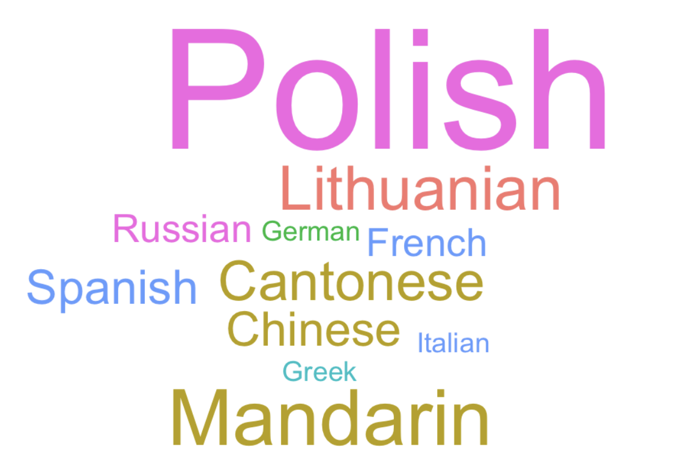



# The Gramma`R` of Graphics {#sec-DataViz}

One of the advantages of working in `R` is that it allows us to create beautiful graphs for effective data visualisation. In this chapter, we will focus on the Grammar of Graphics [@wilkinsonGrammarGraphics2005], a theoretical framework that defines a structured approach to building and understanding statistical graphs, and on using the tidyverse package [{ggplot2}](https://ggplot2.tidyverse.org/) [@Wickhamggplot2Elegantgraphics2016] to create effective data visualisations. The {ggplot2} is an implementation of the Grammar of Graphics (GG) syntax in `R`.

This chapter is divided into two parts: the first explains the **syntax** of the Grammar of Graphics and how the {ggplot2} package works, while the second part focuses on the **semantics** of statistical graphics and provides an introduction to the most common types of data visualisations that are used in the language sciences.

### Chapter overview {.unnumbered}

In this chapter, you will learn how to:

-   Create and interpret barplots to visualise categorical variables
-   Create and interpret histograms, density plots, and violin plots to visualise continuous numeric variables
-   Create and interpret boxplots to visualise the distribution of continuous numeric variables across different subsets of the data
-   Create and interpret scatterplots to visualise correlations between pairs of numeric variables
-   Create and interpret facetted plots to explore the relationship between three or more variables at once
-   Create interactive plots for data exploration

::: {.content-visible when-format="html"}
](images/AHorst_ggplot2.png){fig-alt="A fuzzy monster in a beret and scarf, critiquing their own column graph on a canvas in front of them while other assistant monsters (also in berets) carry over boxes full of elements that can be used to customize a graph (like themes and geometric shapes). In the background is a wall with framed data visualizations. Stylised text reads: ggplot2: build a data masterpiece."}
:::

### Set-up and data import {.unnumbered .unlisted}

::: {.callout-warning collapse="false"}
### Prerequisites

This chapter assumes that you are familiar with the concepts of descriptive statistics explained in @sec-DescRiptiveStats and the data wrangling functions from @sec-DataWrangling.

All examples and quiz questions are based on data from:

> Dąbrowska, Ewa. 2019. Experience, Aptitude, and Individual Differences in Linguistic Attainment: A Comparison of Native and Nonnative Speakers. Language Learning 69(S1). 72-100. <https://doi.org/10.1111/lang.12323>.

Our starting point for this chapter is the wrangled combined dataset that we created and saved in @sec-DataWrangling. Follow the instructions in @sec-filter to create this `R` object.

Alternatively, you can download `Dabrowska2019.zip` from [the textbook's GitHub repository](https://github.com/elenlefoll/RstatsTextbook/raw/69d1e31be7394f2b612825f031ebffeb75886390/Dabrowska2019.zip){.uri}. To launch the project correctly, first unzip the file and then double-click on the `Dabrowska2019.Rproj` file.
:::

Before we begin, we must load the `combined_L1_L2_data.rds` file that we created and saved in @sec-DataWrangling. This file contains the data of all the L1 and L2 participants of @DabrowskaExperienceAptitudeIndividual2019. We have converted all categorical variables to factors and corrected obvious data entry errors and typos (see @sec-DataWrangling).

```{r}
library(here)
library(tidyverse)

Dabrowska.data <- readRDS(file = here("data", "processed", "combined_L1_L2_data.rds"))
```

Check that your data are correctly imported by examining the output of `View(Dabrowska.data)` and `str(Dabrowska.data)`. Once you are satisfied that that's the case, you are ready to get creative! `r emoji("art")`

## The syntax of graphics {#sec-Syntax}

The syntax of the Grammar of Graphics [@wilkinsonGrammarGraphics2005] is made up of **layers** (see @fig-layers), which allow us to create highly effective and efficient data visualisations, while giving us lots of flexibility and control.

 (CC BY-NC-SA *Centre de la science de la biodiversité du Québec*)](images/gglayers.png){#fig-layers width="60%" fig-alt="A layered diagram illustrating the key elements of data visualization: Data, Aesthetics, Geometries, Facets, Statistics, Coordinates, and Theme, each shown as a layer with a distinct colour."}

The **data** layer and the **aesthetics** layer are compulsory as you cannot build a graph that does not map *some* data onto *some* visual aspect (i.e. an "aesthetic") of a graph. The remaining layers are optional, but some are very important. In the following, we will explain how the **geometries**, **facet**, **scales**, **coordinates**, and **theme** layers are used to build and customise graphs using the {ggplot2} library.

### Aesthetics {#sec-aes}

:::: {.content-visible when-format="html"}
::: column-margin
 package](images/hex_ggplot2.png){width="100" fig-alt="The hexagonal logo of the ggplot2 package features a graph with dots that are connected by a line."}
:::
::::

As explained in the documentation, the `ggplot()` function[^10_dataviz-1] has two compulsory arguments (see `?ggplot`). First, we must select the **data** that we want to visualise. Second, we must specify which variable(s) from the data should be mapped onto which visual property or **aesthetics** (short: `aes`) of the plot.

[^10_dataviz-1]: Note that, while the library is called {ggplot2}, its main function is called `ggplot()`.

::: {.content-visible when-format="html"}
> |                  |                 |
> |------------------|-----------------|
> | ggplot {ggplot2} | R Documentation |
>
> ### Description {.unnumbered .unlisted}
>
> `ggplot()` initializes a ggplot object. It can be used to declare the input data frame for a graphic and to specify the set of plot aesthetics intended to be common throughout all subsequent layers unless specifically overridden.
>
> ### Usage {.unnumbered .unlisted}
>
> ```         
> ggplot(data = NULL, mapping = aes(), ...)
> ```
:::

For example, to create a barplot visualising the distribution of participants' occupational groups in the combined dataset from @DabrowskaExperienceAptitudeIndividual2019 (`Dabrowska.data`), we need to map the `OccupGroup` variable from `Dabrowska.data` onto our plot's *x-*axis (`x`).

```{r}
#| fig-cap: "A first attempt to plot the distribution of participants' occupational groups in Dąbrowska (2019)"
#| label: "fig-EmptyBarplot"
#| fig-alt: "An empty plot with the x-axis labeled OccupGroup and four group labels: C, I, M, and PS. No data is shown."
#| out-width: "70%"

ggplot(data = Dabrowska.data,
       mapping = aes(x = OccupGroup))

```

As you can see from @fig-EmptyBarplot, however, running this code returns an empty plot! All we get is a grid background and a nicely labelled *x-*axis, but no data... Why might that be? `r emoji("thinking")`

### Geometries {#sec-geoms}

The reason we are not seeing any data is that we have not yet specified with which kind of **geometry** (short: **geom**) we would like to plot the data. The {ggplot2} library features more than 30 different geom functions! They all begin with the prefix `geom_`. To create a barplot showing participants' occupational groups, we need to add a `geom_bar()` **layer** to our empty `ggplot` object (see @fig-barplot1).

```{r}
#| fig-cap: "Distribution of participants' occupational groups (C = clerical position, I = inactive, i.e. unemployed, retired, or homemakers, M = manual jobs, PS = professional-level job or studying for a degree)"
#| label: "fig-barplot1"
#| fig-alt: "A barplot showing the number of various occupational groups. The x-axis is labeled as OccupGroup and represents different occupation categories: C, I, M, and PS, with PS having the highest count of them all. The y-axis represents the number of individuals in each group and is labeled as count."
#| out-width: "70%"

ggplot(data = Dabrowska.data,
       mapping = aes(x = OccupGroup)) +
  geom_bar()
```

::::: callout-warning
### Frequent error {.unnumbered}

Note that we use the `+` operator to *add* layers to `ggplot` objects. You might be tempted to use the pipe operator (`|>`). But if we try to pipe something *inside* the `ggplot()` function, `R` returns an error message:

```{r eval = FALSE}
ggplot(data = Dabrowska.data,
       mapping = aes(x = OccupGroup)) |> 
  geom_bar()
```

::: {.content-visible when-format="html"}
```         
Error in `geom_bar()`: 
! `mapping` must be created by `aes()`. 
ℹ Did you use `%>%` or `|>` instead of `+`? 
Run `rlang::last_trace()` to see where the error occurred.
```
:::

::: {.content-visible when-format="pdf"}
```         
Error in `geom_bar()`: 
! `mapping` must be created by `aes()`. 
i Did you use `%>%` or `|>` instead of `+`? 
Run `rlang::last_trace()` to see where the error occurred.
```
:::
:::::

### Statistics and labels {#sec-StatsLabs}

We now have a simple barplot that represents the distribution of participants' occupational groups in @DabrowskaExperienceAptitudeIndividual2019. By default, the axis labels are simply the names of the variables that are mapped onto the plot's aesthetics. That's why, in @fig-barplot1, our *x*-axis is labelled "OccupGroup".

What about the *y*-axis? We did not specify a *y*-aesthetic within the mapping argument of our `ggplot()` object, yet the *y*-axis is labelled "count". This is because `geom_bar()` automatically computes a "count" **statistic** that gets mapped to the *y*-aesthetic. If we want to change these axis labels, we can do so by adding a `labs()` **layer** to our plot (see @fig-BarOccupGroup).

```{r}
#| fig-cap: "Distribution of participants' occupational groups (C = clerical position, I = inactive, M = manual jobs, PS = professional-level job or studying for a degree)"
#| label: "fig-BarOccupGroup"
#| fig-alt: "This is the same barplot as above. The only difference is that the x-axis is labeled as Occupational group and the y-axis is labeled as Number of participants."
#| out-width: "70%"

ggplot(data = Dabrowska.data,
       mapping = aes(x = OccupGroup)) +
  geom_bar() +
  labs(x = "Occupational group",
       y = "Number of participants")
```

:::: {.content-visible when-profile="OER"}
::: {.callout-tip collapse="false"}
#### Your turn! {.unnumbered}

[**Q10.1**]{style="color:green;"} Which of the following labels can be added or modified using the `labs()` function?

```{r}
#| echo: false
#| label: "Q10.1"
library(checkdown)
check_question(c("x-axis label",
                 "y-axis label",
                 "plot title",
                 "plot subtitle", 
                 "plot caption",
                 "plot alt-text"),
                 options = c("x-axis label",
                 "y-axis label",
                 "plot title",
                 "plot subtitle", 
                 "plot caption",
                 "plot alt-text"), 
               type = "check", 
               random_answer_order = TRUE,
               q_id = "Q10.1", 
               alignment = "vertical",
               button_label = "Check answer",
               right = "That's right and there are many more possibilities! For instance, it's also possible to change the title of a plot's legend using the labs() function.",
               wrong = "No, there are more labels that can be ammended.")
check_hint("Check out the function's help file to find out more about its possibilities by entering ?labs in the Console.", hint_title = "🐭 Click on the mouse for a hint.")
```
:::
::::

::: {.callout-note collapse="false"}
#### What is alt-text and why is it important?

Alternative text, or **alt-text**, is a concise description of an image used to make its informational content accessible to people with visual impairments. Using a screen reader programme, blind and low-vision readers can have the alt-text associated with an image read out to them.

A good alt-text aims to convey the main message and insights of the graph, allowing someone who cannot see it to understand the information being presented [see @universityofsouthcarolinaAlternativeText and @w3cwebaccessibilityinitiativewaiImages2022 for concise tutorials on how to write good alt-texts for all kinds of images]. In the context of online publications, alt-text is also useful in regions with low bandwidth as images may take a very long time to load. By including alt-text, we can therefore make our work more accessible and inclusive, enabling more people to engage with and understand our data and analyses.

@sec-QuartoFigures explains how to add alt-text to plots and figures in Quarto documents. If you take a peek at the [source code](https://github.com/elenlefoll/RstatsTextbook/blob/main/10_Dataviz.qmd) of this textbook chapter, you will see that every figure in this textbook is described with alt-text. Whilst some AI products now claim to be able to automatically generate alt-text for us, it is best to write alt-text ourselves. This is because auto-generated alt-text often does not focus on the visual information that we want to convey, misses out on important aspects, and/or overwhelms the user with redundant information (for more on AI-assisted research and learning, see @sec-AI).

Blind and low-vision readers may also want to check out the [{BrailleR}](https://ajrgodfrey.github.io/BrailleR/articles/BrailleR.html) package [@godfreyBrailleRImprovedAccess2025], which converts plots generated in `R` into a textual form that can be interpreted by blind and low-vision `R` users who cannot access the graphs without printing the image to a tactile embosser, or who need the extra text to support any tactile images that they have created.

```{r}
#| include: false
#| eval: false

# https://github.com/ajrgodfrey/BrailleR
#install.packages("remotes")
remotes::install_github("ajrgodfrey/BrailleR", upgrade=TRUE, quiet=TRUE)

library(BrailleR)
BrailleR::Describe()
```
:::

### Data {#sec-ggplotData}

Instead of using the **data** argument of the `ggplot()` function as we did above, we can **pipe** the data into the function's first argument (see @sec-Piping). Compare these two methods and their outputs.

::::::: {.content-visible when-format="html"}
:::::: columns
::: {.column width="48%"}
**Using the data argument of `ggplot()`**

```{r}
#| fig-alt: "This is the same barplot as above."

ggplot(data = Dabrowska.data,
       mapping = aes(x = OccupGroup)) +
  geom_bar() +
  labs(x = "Occupational group",
       y = "Number of participants")
```
:::

::: {.column width="2%"}
<!-- empty column to create gap -->
:::

::: {.column width="48%"}
**Piping the data into `ggplot()`**

```{r}
#| fig-alt: "This is the same barplot as above even though the code used to generate it is slightly different."

Dabrowska.data |> 
  ggplot(mapping = aes(x = OccupGroup)) +
  geom_bar() +
  labs(x = "Occupational group",
       y = "Number of participants")
```
:::
::::::
:::::::

::::: {.content-visible when-format="pdf"}
**Using the data argument of `ggplot()`**

```{r}
#| fig-alt: "This is the same barplot as above."
#| out-width: "40%"
#| eval: false

ggplot(data = Dabrowska.data,
       mapping = aes(x = OccupGroup)) +
  geom_bar() +
  labs(x = "Occupational group",
       y = "Number of participants")
```

**Piping the data into `ggplot()`**

```{r}
#| fig-alt: "This is the same barplot as above even though the code used to generate it is slightly different."
#| out-width: "40%" 
#| eval: false

Dabrowska.data |> 
  ggplot(mapping = aes(x = OccupGroup)) +
  geom_bar() +
  labs(x = "Occupational group",
       y = "Number of participants")
```
:::::

The outputs are exactly the same! Piping the dataset into the `ggplot()` function, however, allows us to easily wrangle the data that we want to visualise 'on the fly', without transforming the data object itself. For example, we can use the tidyverse `filter()` function (see @sec-filter) to examine the distribution of occupational groups among L2 participants only (see @fig-BarOccupGroupL2).

```{r}
#| source-line-numbers: "2"
#| label: "fig-BarOccupGroupL2"
#| fig-cap: "Distribution of L2 participants' occupational groups in @DabrowskaExperienceAptitudeIndividual2019"
#| fig-alt: "Barplot with the title of Occupational groups of L2 participants showing the distribution of L2 participants' occupational group. The x-axis is labeled as Occupational group with PS having the highest count, and the y-axis is labeled as Number of participants."
#| out-width: "70%"

Dabrowska.data |> 
  filter(Group == "L2") |> 
  ggplot(mapping = aes(x = OccupGroup)) +
  geom_bar() +
  labs(x = "Occupational group",
       y = "Number of participants")
```

We can also combine several `filter()` conditions using the `&` (AND) and `|` (OR) operators. For example, we may want to visualise the distribution of the occupational groups of participants who are L2 speakers of English *and* whose first language is Polish (see @fig-BarOccupGroupL2Polish).

```{r}
#| source-line-numbers: "2"
#| label: "fig-BarOccupGroupL2Polish"
#| fig-cap: "Distribution of Polish participants' occupational groups in @DabrowskaExperienceAptitudeIndividual2019"
#| fig-alt: "Barplot showing the number of Polish L2 participants across occupational groups C, I, M, and PS, with M having the highest count. The x-axis and the y-axis are labeled as the plot above. The title of the plot is Occupational groups of Polish L2 participants."
#| out-width: "70%"

Dabrowska.data |> 
  filter(Group == "L2" & NativeLg == "Polish") |> 
  ggplot(mapping = aes(x = OccupGroup)) +
  geom_bar() +
  labs(x = "Occupational group",
       y = "Number of participants")
```

### Facets {#sec-facets}

If we want to compare two subsets of the data, we can add a **facet layer** to subdivide the plot into several plots each representing a subset of the data. In the following, we use the `facet_wrap()` function to subdivide our barplot by the `Group` variable (`~ Group`). This allows us to easily compare the distribution of occupations across L1 and the L2 participants (see @fig-BarOccupGroupFacet).

```{r}
#| source-line-numbers: "4"
#| label: "fig-BarOccupGroupFacet"
#| fig-cap: "Distribution of L1 (left) and L2 (right) participants' occupational groups in @DabrowskaExperienceAptitudeIndividual2019"
#| fig-alt: "Barplot titled Occupational groups of participants showing the number of participants in four occupational groups for two categories, L1 and L2. The plot is divided into two panels: in the L1 group, the number of participants is roughly equal across all occupations, ranging from about 20 to 25. In the L2 group, PS has the highest number of participants at over 30, followed by M and C, while I has the fewest participants."
#| out-width: "80%"

Dabrowska.data |> 
  ggplot(mapping = aes(x = OccupGroup)) +
  geom_bar() +
  facet_wrap(~ Group) +
  labs(x = "Occupational group",
       y = "Number of participants")
```

::: callout-warning
#### Frequent error when attempting to generate a plot in *RStudio* {.unnumbered}

```         
Error in seq.default(from, to, by) : invalid '(to - from)/by' 
```

If you get this error message when trying to run a chunk of code that generates a plot, this is most likely due to your Plots pane in *RStudio* not being large enough to accommodate the plot. If you increase its size and rerun the chunk, your plot should appear in the Plots pane as expected.

If you have a small screen, you can also click on the `r emoji("mag_right")` Zoom button at the top of the Plots pane to view your plot in a separate *RStudio* window, which you can resize according to your needs.
:::

To compare the distributions of occupations of the male and female L2 participants, we can combine a `filter()` operation to select only the L2 participants with a `facet_wrap()` layer (see @fig-BarOccupGroupL2Facet).

```{r}
#| source-line-numbers: "2"
#| label: "fig-BarOccupGroupL2Facet"
#| fig-cap: "Distribution of occupational groups among female (left) and male (right) L2 participants"
#| fig-alt: "Barplot showing the L2 participants across four occupational groups. The plot is divided into two panels: F and M. In both, the largest category is the group PS. There are more female participants belonging to the C group than male."
#| out-width: "80%"

Dabrowska.data |> 
  filter(Group == "L2") |> 
  ggplot(mapping = aes(x = OccupGroup)) +
  geom_bar() +
  facet_wrap(~ Gender) +
  labs(x = "Occupational group",
       y = "Participants")
```

To explore potential gender differences in occupational groups across both L1 and L2 groups, we can combine the two variables within the `facet_wrap()` function (see @fig-TwoFacetsBarplot).

```{r}
#| source-line-numbers: "4"
#| fig-asp: 1
#| label: "fig-TwoFacetsBarplot"
#| fig-cap: "Distribution of occupational groups among female (left) and male (right) L1 (top) and L2 (bottom) participants"
#| fig-alt: "Barplot showing the number of participants across four occupational groups, split by language group (L1 and L2) and gender (F and M). The plot has four panels. L1 Female participant counts are relatively even across groups, with the highest in PS. In L2 Female panel a large number of participants are in the PS group, in L1 Male panel all occupational groups have similar participant counts, and in L2 Male panel PS and M have the highest counts."
#| out-width: "70%"

Dabrowska.data |> 
  ggplot(mapping = aes(x = OccupGroup)) +
  geom_bar() +
  facet_wrap(~ Group + Gender) +
  labs(x = "Occupational group",
       y = "Participants")
```

### Scales {#sec-scales}

Scale layers allow us to map data values to the visual values of an aesthetic. For example, to make our facetted plot in @fig-TwoFacetsBarplot easier to read, we could add some colour using a **fill** aesthetic to fill each bar with a colour that corresponds to the participants' gender. To do so, we map each unique value of the variable `Gender` ("F" and "M") onto a colour that is then used to fill the corresponding bars of our barplot. Adding the fill aesthetic automatically generates a legend (see @fig-ColourBarplot).

```{r}
#| source-line-numbers: "3"
#| fig-asp: 1
#| label: "fig-ColourBarplot"
#| fig-cap: "A facetted barplot with default {scales} colours"
#| fig-alt: "This is the same plot as above. The only difference is that the bars in the two F panels are in the colour light red, and the bars in the two M panels are in the colour blue. There is a legend titled Gender on the right side of the plot that shows which colour shows which category."
#| out-width: "70%"

Dabrowska.data |> 
  ggplot(mapping = aes(x = OccupGroup, 
                       fill = Gender)) +
  geom_bar() +
  facet_wrap(~ Group + Gender) +
  labs(x = "Occupational group",
       y = "Participants")
```

As we did not specify any fill colours for @fig-ColourBarplot, {ggplot2} used default colours taken from the {scales} package of the tidyverse environment. This is because, in the Grammar of Graphics, colour palettes are governed by scales. To specify a different set of colours, we therefore need to specify a **scale layer**. One way to do this is to use `scale_fill_manual()` to manually pick our own colours, either using [`R` colour codes](https://r-charts.com/colors/) (such as `purple`) or [hexadecimal colour codes](https://www.w3schools.com/colors/colors_picker.asp) (such as `#34027d`). Note that both types of colour codes must be enclosed in quotation marks.

```{r}
#| fig-cap: "A facetted barplot with hand-picked colours"
#| label: "fig-PurpleBarplot"
#| source-line-numbers: "3,8"
#| fig-asp: 1
#| fig-alt: "This is the same plot as above. The only difference is that the bars in the two F panels are in the colour light purple, and the bars in the two M panels are in the dark purple."
#| out-width: "70%"

Dabrowska.data |> 
  ggplot(mapping = aes(x = OccupGroup, 
                       fill = Gender)) +
  geom_bar() +
  facet_wrap(~ Group + Gender) +
  labs(x = "Occupational group",
       y = "Participants") +
  scale_fill_manual(values = c("purple", "#34027d"))
```

Although it makes the plot easier to interpret, the colour aesthetic (here `fill`) is not strictly necessary to understand the data represented in @fig-PurpleBarplot. After all, the two `gender` subgroups are already distinguished by the `facet_wrap()` layer. That's not necessarily a bad thing, but you must consider whether such redundant elements facilitate the interpretation of the data visualised or not.

In some cases, colour is used as the *only* way of identifying subgroups in the data, for example in a **stacked barplot** (see @fig-ColourStackedBarplot). In such cases, it is important to consider how the plot will be perceived by different people (see note on colour blindness below).

```{r}
#| fig-cap: "A stacked barplot with hand-picked colours"
#| label: "fig-ColourStackedBarplot"
#| source-line-numbers: "3,5"
#| fig-alt: "Barplot showing the number of participants across four occupational groups, split by two language groups (L1 and L2). Each bar in this plot contains two colours: light purple representing female participants and dark purple representing male ones. There is a legend titled Gender on the right side of the plot."
#| out-width: "80%"

Dabrowska.data |> 
  ggplot(mapping = aes(x = OccupGroup, 
                       fill = Gender)) +
  geom_bar() +
  facet_wrap(~ Group) +
  labs(x = "Occupational group",
       y = "Participants") +
  scale_fill_manual(values = c("purple", "#34027d"))
```

**Scale** layers can be used to control the axes of your plots. Play around with the `expand` and `limits` arguments of the `scale_y_continuous()` function to understand how they work.

```{r}
#| fig-cap: "A barplot with a *y-*axis that starts at zero and ends at 100"
#| label: "fig-Barplot0"
#| source-line-numbers: "9,10"
#| fig-alt: "This is the same facetted barplot as above except that now the plot area start exactly at zero participant and is expanded to 100, even though the largest category (PS) has fewer than 60 participants."
#| out-width: "70%"

Dabrowska.data |> 
  ggplot(mapping = aes(x = OccupGroup)) +
  geom_bar() +
  labs(x = "Occupational group",
       y = "Participants") +
  scale_y_continuous(expand = c(0,0),
                     limits = c(0,100))  
```

::: {.callout-note collapse="false"}
#### A note on colours and colour blindness `r emoji("rainbow")`

Colour blindness is a condition that results in a decreased ability to see colours and perceive differences in colour. There are different types of colour blindness but, in general, it is best to avoid red-green contrasts. To ensure that your data visualisations are accessible to as many people as possible, you may want to use the [{colorBlindness}](https://cran.r-project.org/web/packages/colorBlindness/vignettes/colorBlindness.html) package [@ouColorBlindnessSafeColor2021] to simulate the appearance of a set of colours for people with different forms of colour blindness.

```{r}
#| fig-cap: "Default {scales} discrete palette as perceived with different forms of colour blindness"
#| label: "fig-colorBlindness"
#| fig-alt: "A graphic composed of multiple coloured boxes, the top row corresponding to the default {scales} discrete palette as perceived by people with 'normal vision'. The following rows simulate how these colours are perceived by someone with deuteranope and protanope colour blindness, and in grey-scale, respectively. In these rows, the shades of the six colours are hardly distinguisable from each other."
#| out-width: 80%
#| fig-height: 5

#install.packages("colorBlindness")
library(colorBlindness)
colorBlindness::displayAllColors(scales::hue_pal()(6))
```

Using the {colorBlindness} package, we can immediately see that the default {scales} discrete palette that {ggplot2} used in @fig-ColourBarplot is not accessible to colour-blind people (deuteranope and protanope), nor is it distinguishable when printed in grey-scale (desaturate). In contrast, our hand-picked colours from @fig-PurpleBarplot fare much better.

```{r}
#| fig-cap: "The colours we selected in @fig-PurpleBarplot as perceived with different forms of colour blindness"
#| label: "fig-colorBlindness2"
#| fig-alt: "A similar graphic to the one above, but this time with the two shades of purple selected earlier and the contrast between the two is clear for all types of colour blindness represented by this package."
#| fig-height: 3
#| out-width: 70%

colorBlindness::displayAllColors(c("pink", "#34027d"))
```

But you need not manually pick colours, as many people have developed and shared `R` packages that feature attractive, ready-to-use colour-blind friendly palettes. The [{viridis}](https://cran.r-project.org/web/packages/viridis/vignettes/intro-to-viridis.html) package [@garnierSjmgarnierViridisCRAN2023], for example, includes eight such palettes ("magma", "inferno", "plasma", "cividis", "rocket", "turbo") that also reproduce well in grey-scale. And, as it is included in the {ggplot2} installation, you don't even need to install the {viridis} package separately!

```{r}
#| fig-height: 5
#| out-width: 80%
#| label: "fig-colourBlindnessViridis"
#| fig-cap: "Colours from the {viridis} package palette as perceived with different forms of colour blindness"
#| fig-alt: "A similar graphic to the one above, but this time with colours from the viridis package, which can be distinguished by most colour-blind people."

colorBlindness::displayAllColors(viridis::viridis(6))
```

Choosing an appropriate palette is not the only way to make your visualisations accessible to colour-blind readers. Another way is to provide redundant mappings to other aesthetics such as size, line type, shape, or pattern.

Finally, it is important to remember that colour blindness is by no means the only type of visual impairment you should consider when creating visualisations. Worldwide, far more people are affected by **blindness** and **low vision**. @sec-QuartoFigures explains how to add **alternative texts** (alt-text) to plots and images. Many people with visual impairments rely on screen readers that use these alternative texts to provide audio descriptions of images and plots. These alternative texts can also improve the experience of users facing internet connection issues resulting in images that do not load properly or quickly enough.
:::

Some academic publishers still require grey-scale plots, in which case you will want to use the **scale** layer `scale_fill_grey()`. Alternatively, the colour palettes of the {viridis} package (see information box on colour blindness) render well in grey, too. The {viridis} function for a discrete colour scale (as needed for a categorical variable such as `Gender`) can be called up using the `scale_fill_viridis_d()` function. With the `option` argument, you can switch between eight different viridis palettes ("magma", "inferno", "plasma", "cividis", "rocket", "turbo").

:::: {.content-visible when-format="html"}
::: panel-tabset
###### scale_fill_grey()

```{r}
#| source-line-numbers: "9"
#| fig-height: 4
#| fig-alt: "The stacked barplot from Figure 10.13 in grey-scale."

Dabrowska.data |> 
  ggplot(mapping = aes(x = OccupGroup, fill = Gender)) +
  geom_bar() +
  facet_wrap(~ Group) +
  labs(x = "Occupational group",
       y = "Participants") +
  scale_y_continuous(expand = c(0,0),
                     limits = c(0,35)) +
  scale_fill_grey()
```

###### scale_fill_viridis_d

```{r}
#| source-line-numbers: "9"
#| fig-height: 4
#| fig-alt: "The stacked barplot from Figure 10.13 in the default viridis palette."

Dabrowska.data |> 
  ggplot(mapping = aes(x = OccupGroup, fill = Gender)) +
  geom_bar() +
  facet_wrap(~ Group) +
  labs(x = "Occupational group",
       y = "Participants") +
  scale_y_continuous(expand = c(0,0),
                     limits = c(0,35)) +
  scale_fill_viridis_d(option = "viridis")
```

###### scale_fill_viridis_d(option = "turbo")

```{r}
#| source-line-numbers: "9"
#| fig-height: 4
#| fig-alt: "The stacked barplot from Figure 10.13 in the 'turbo' viridis palette."

Dabrowska.data |> 
  ggplot(mapping = aes(x = OccupGroup, fill = Gender)) +
  geom_bar() +
  facet_wrap(~ Group) +
  labs(x = "Occupational group",
       y = "Participants") +
  scale_y_continuous(expand = c(0,0),
                     limits = c(0,35)) +
  scale_fill_viridis_d(option = "turbo")
```
:::
::::

If you like colours, check out the {paletteer} package [@hvitfeldtPaletteerComprehensiveCollection2021], which provides a neat interface to access a very large collection of `R` colour palette packages, some of which are very fun! The advantage is that you only need to install one package (`install.packages("paletteer")`) to have a huge range of palettes at your disposal. [Below is a small selection of some personal favourites.]{.content-visible when-format="html"}.

:::: {.content-visible when-format="html"}
::: panel-tabset
##### beyonce::X11

```{r}
#| source-line-numbers: "8"
#| fig-height: 4
#| fig-alt: "The barplot from Figure 10.5 in the 'beyonce:X11' palette."

Dabrowska.data |> 
  ggplot(mapping = aes(x = OccupGroup, fill = OccupGroup)) +
  geom_bar() +
  labs(x = "Occupational group",
       y = "Participants") +
  scale_y_continuous(expand = c(0,0),
                     limits = c(0,60)) +
  paletteer::scale_fill_paletteer_d("beyonce::X11")
```

##### BridgetRiley

```{r}
#| source-line-numbers: "8"
#| fig-height: 4
#| fig-alt: "The barplot from Figure 10.5 in the 'BridgetRiley' palette."

Dabrowska.data |> 
  ggplot(mapping = aes(x = OccupGroup, fill = OccupGroup)) +
  geom_bar() +
  labs(x = "Occupational group",
       y = "Participants") +
  scale_y_continuous(expand = c(0,0),
                     limits = c(0,60)) + 
  paletteer::scale_fill_paletteer_d("lisa::BridgetRiley", direction = -1)
```

##### janelle

```{r}
#| source-line-numbers: "8"
#| fig-height: 4
#| fig-alt: "The barplot from Figure 10.5 in the 'janelle' palette."

Dabrowska.data |> 
  ggplot(mapping = aes(x = OccupGroup, fill = OccupGroup)) +
  geom_bar() +
  labs(x = "Occupational group",
       y = "Participants") +
  scale_y_continuous(expand = c(0,0),
                     limits = c(0,60)) +
  paletteer::scale_fill_paletteer_d("rockthemes::janelle")
```

##### FridaKahlo

```{r}
#| source-line-numbers: "8"
#| fig-height: 4
#| fig-alt: "The barplot from Figure 10.5 in the 'FridaKahlo' palette."

Dabrowska.data |> 
  ggplot(mapping = aes(x = OccupGroup, fill = OccupGroup)) +
  geom_bar() +
  labs(x = "Occupational group",
       y = "Participants") +
  scale_y_continuous(expand = c(0,0),
                     limits = c(0,60)) +
  paletteer::scale_fill_paletteer_d("lisa::FridaKahlo", direction = -1)
```

##### kiss

```{r}
#| source-line-numbers: "8"
#| fig-height: 4
#| fig-alt: "The barplot from Figure 10.5 in the 'kiss' palette."

Dabrowska.data |> 
  ggplot(mapping = aes(x = OccupGroup, fill = OccupGroup)) +
  geom_bar() +
  labs(x = "Occupational group",
       y = "Participants") +
  scale_y_continuous(expand = c(0,0),
                     limits = c(0,60)) +
  paletteer::scale_fill_paletteer_d("ltc::kiss")
```

##### speakNow

```{r}
#| source-line-numbers: "8"
#| fig-height: 4
#| fig-alt: "The barplot from Figure 10.5 in the 'speakNow' palette."

Dabrowska.data |> 
  ggplot(mapping = aes(x = OccupGroup, fill = OccupGroup)) +
  geom_bar() +
  labs(x = "Occupational group",
       y = "Participants") +
  scale_y_continuous(expand = c(0,0),
                     limits = c(0,60)) +
  paletteer::scale_fill_paletteer_d("tayloRswift::speakNow")
```
:::
::::

### Themes {#sec-themes}

The {ggplot2} framework also allows for the addition of an optional `theme()` **layer** to further customise the look of plots. The default {ggplot2} theme is `theme_grey()`. Here are some of the pre-built themes that come with the {ggplot2} library for you to try out and compare:

-   `theme_bw()`
-   `theme_classic()`
-   `theme_dark()`
-   `theme_light()`
-   `theme_minimal()`
-   `theme_void()`

:::: {.content-visible when-format="html"}
::: panel-tabset
##### theme_bw()

```{r}
#| source-line-numbers: "6"
#| fig-alt: "The barplot from Figure 10.5 displayed in black and white with a thin black frame and a light grey grid in the background."

ggplot(data = Dabrowska.data,
       mapping = aes(x = OccupGroup)) +
  geom_bar() +
  labs(x = "Occupational group",
       y = "Number of participants") +
  theme_bw()
```

##### theme_classic()

```{r}
#| source-line-numbers: "6"
#| fig-alt: "The barplot from Figure 10.5 displayed in black and white with no background and simple clean lines for the axes."

ggplot(data = Dabrowska.data,
       mapping = aes(x = OccupGroup)) +
  geom_bar() +
  labs(x = "Occupational group",
       y = "Number of participants") +
  theme_classic()
```

##### theme_dark()

```{r}
#| source-line-numbers: "6"
#| fig-alt: "The barplot from Figure 10.5 printed in dark colours with a very dark grey background and grid."

ggplot(data = Dabrowska.data,
       mapping = aes(x = OccupGroup)) +
  geom_bar() +
  labs(x = "Occupational group",
       y = "Number of participants") +
  theme_dark()
```

##### theme_light()

```{r}
#| source-line-numbers: "6"
#| fig-alt: "The barplot from Figure 10.5 in the 'light' theme, very similar to theme_bw() but with a lighter background and grid."

ggplot(data = Dabrowska.data,
       mapping = aes(x = OccupGroup)) +
  geom_bar() +
  labs(x = "Occupational group",
       y = "Number of participants") +
  theme_light()
```

##### theme_minimal()

```{r}
#| source-line-numbers: "6"
#| fig-alt: "The barplot from Figure 10.5 with no black lines for the axes."

ggplot(data = Dabrowska.data,
       mapping = aes(x = OccupGroup)) +
  geom_bar() +
  labs(x = "Occupational group",
       y = "Number of participants") +
  theme_minimal()
```

##### theme_void()

```{r}
#| source-line-numbers: "6"
#| fig-alt: "The barplot from Figure 10.5 with no axes and no labels whatsever, just the bars."

ggplot(data = Dabrowska.data,
       mapping = aes(x = OccupGroup)) +
  geom_bar() +
  labs(x = "Occupational group",
       y = "Number of participants") +
  theme_void()
```
:::
::::

As with colour palettes, you can also install additional packages that will give you access to literally hundreds of ready-made themes for you to explore. @fig-Economist customised by adding a `theme_economist()` layer from the {ggthemes} package [@ggthemes2025].

```{r}
#| source-line-numbers: "1,2,9,10"
#| label: fig-Economist
#| fig-cap: "Barplot with a theme inspired by *The Economist* magazine"
#| fig-alt: "The barplot from Figure 10.5 labels in a different font, bars filled with different shades of blue and grey, a light blue background, white lines, and a legend at the top of the graph as opposed to one the right."
#| fig-asp: 0.8
#| out-width: 70%

#install.packages("ggthemes")
library(ggthemes)

ggplot(data = Dabrowska.data,
       mapping = aes(x = OccupGroup,
                     fill = OccupGroup)) +
  geom_bar() +
  labs(x = "Occupational group",
       y = "Number of participants") +
  scale_fill_economist() +
  theme_economist()
```

Pretty much all aspects of plot themes can be customised. To demonstrate this, the code below creates @fig-SillyTheme, a barplot with some highly customised aesthetics. I will let you judge how meaningful these custom choices are and whether they genuinely help the reader to interpret the data... `r emoji("raised_eyebrow")`

::: {.content-visible when-format="html"}
```{r}
#| eval: !expr 'knitr::is_html_output()'
#| code-fold: true
#| code-summary: "Show code customising `ggplot` theme layer."
#| label: fig-SillyTheme
#| fig-cap: "Barplot demonstrating customisation options of the `ggplot` theme layer"
#| fig-alt: "A barplot showing the number of participants by occupational group. The plot features unconventional styling including a peach background, bright yellow grid lines, vertical axis labels, and bold colored text. It is very ugly and very difficult to read."

ggplot(data = Dabrowska.data,
       mapping = aes(x = OccupGroup, fill = Gender)) +
  geom_bar() +
  labs(x = "Occupational group",
       y = "Number of participants",
       title = "An example of an extravagantly customised ggplot...") +
    theme(
      panel.background = element_rect(fill = "#FFC080", color = NA),
      panel.grid.major = element_line(color = "gold", linewidth = 1.5),
      panel.grid.minor = element_line(color = "grey20", linewidth = 0.5),
      axis.title.x = element_text(face = "bold", size = 12, color = "brown", angle = 10),
      axis.title.y = element_text(size = 25, color = "green", family = "Courier New"),
      axis.text.x = element_text(face = "italic", size = 12, color = "cyan"),
      axis.text.y = element_text(size = 14, color = "grey"),
      plot.title = element_text(face = "bold", size = 10, color = "purple", family = "Comic Sans MS"))
```
:::

::: {.content-visible when-format="pdf"}
```{r}
#| eval: false
#| echo: true

ggplot(data = Dabrowska.data,
       mapping = aes(x = OccupGroup, fill = Gender)) +
  geom_bar() +
  labs(x = "Occupational group",
       y = "Number of participants",
       title = "An example of an extravagantly customised ggplot...") +
    theme(
      panel.background = element_rect(fill = "#FFC080", color = NA),
      panel.grid.major = element_line(color = "gold", linewidth = 1.5),
      panel.grid.minor = element_line(color = "grey20", linewidth = 0.5),
      axis.title.x = element_text(face = "bold", size = 12, color = "brown", angle = 10),
      axis.title.y = element_text(size = 25, color = "green", family = "Courier New"),
      axis.text.x = element_text(face = "italic", size = 12, color = "cyan"),
      axis.text.y = element_text(size = 14, color = "grey"),
      plot.title = element_text(face = "bold", size = 10, color = "purple", family = "Comic Sans MS"))
```

{#fig-SillyTheme fig-alt="A barplot showing the number of participants by occupational group. The plot features unconventional styling including a peach background, bright yellow grid lines, vertical axis labels, and bold colored text. It is very ugly and very difficult to read." width="80%"}
:::

### Coordinates {#sec-coordinates}

By default, the coordinate system that is used in `ggplot` objects is the **Cartesian coordinate system**, which has a horizontal axis (*x*) and a vertical axis (*y*) that are perpendicular to each other. To change this default Cartesian coordinate system, we need to add a **coordinate layer**.

For example, to be able to display the full names of the four occupational groups used in @DabrowskaExperienceAptitudeIndividual2019, we can change the labels of the categories using `mutate()` and `fct_recode()` *before* piping the data into `ggplot()` (see @sec-ggplotData) and then flip the *x* and *y* axes using the coordinate layer `coord_flip()`. As shown in @fig-FlippedBarplot, this makes long labels much easier to read.

```{r}
#| source-line-numbers: "2-6,13"
#| fig-asp: 0.3
#| fig-width: 8
#| label: "fig-FlippedBarplot"
#| fig-cap: "@fig-ColourStackedBarplot displayed horizontally."
#| fig-alt: "A horizontal barplot showing the number of participants by occupational group and gender. The chart shows four occupational categories on the y-axis with their full names: Professional-level job/student, Manual profession, Professionally inactive, and Clerical profession."

Dabrowska.data |> 
  mutate(OccupGroup = fct_recode(OccupGroup,
                                 `Professionally inactive` = "I",
                                 `Clerical profession` = "C",
                                 `Manual profession` = "M",
                                 `Professional-level job/\nstudent` = "PS")) |> 
  mutate(Gender = fct_rev(Gender)) |> 
  ggplot(mapping = aes(x = OccupGroup, fill = Gender)) +
  geom_bar() +
  labs(x = NULL,
       y = "Participants") +
  scale_fill_viridis_d() +
  coord_flip() +
  theme_minimal() +
  theme(axis.text = element_text(size = 12))
```

The vast majority of statistical graphs use the Cartesian coordinate system. Pie charts and other circular plots, however, use the **polar coordinate system** (`coord_polar`), whereby quantities are mapped onto angles rather than distances. In general, humans are much better at judging lengths than angles or areas [@clevelandGraphicalPerceptionVisual1987], which is why circular graphs such as pie charts are typically *not* recommended forms of good data visualisations [@fewPiesDessert]. That said, they can be produced using the {ggplot2} library by adding the **coordinate** layer `coord_polar("y")` and modifying a few parameters.

```{r}
#| source-line-numbers: "8-13"
#| out-width: "70%" 
#| label: "fig-OccupGroupPieChart"
#| fig-cap: "@fig-ColourStackedBarplot displayed as a pie chart"
#| fig-alt: "This is a pie chart of the data above. The size of each segment reprensent the number of participants in each category. A legend to the right of the pie matches each occupational group with its corresponding color."

Dabrowska.data |> 
  mutate(OccupGroup = fct_recode(OccupGroup,
                                 `Professionally inactive` = "I",
                                 `Clerical profession` = "C",
                                 `Manual profession` = "M",
                                 `Professional-level job/\nstudent` = "PS")) |> 
  ggplot(mapping = aes(x = "", fill = OccupGroup)) +
  geom_bar(width = 1) +
  labs(fill = "Occupational group") +
  scale_fill_viridis_d(direction = -1) +
  coord_polar("y") +
  theme_void()
```

## The semantics of graphics {#sec-Semantics}

So far, we have seen how the syntax of the Grammar of Graphics can be used to build statistical graphs layer by layer. We now turn to the **semantics** of graphics. As linguists are well placed to know, semantics is the study of **meaning**. In the Grammar of Graphics, the semantics of graphics is defined as "the meanings of the representative symbols and arrangements we use to display information" [@wilkinsonGrammarGraphics2005: 20]. In what follows, we will see how thinking about the semantics of graphics can help us to think about how the different components of a graph interact to convey insightful visual information from raw data. This will help us to make informed choices when choosing the geometries, scales, facets, and themes of our data visualisations.

But, first, let's think about why we visualise data. Data visualisation is about more than just communicating the results of our analyses to others at the publication stage. In fact, good data visualisation can help us make informed decisions throughout the research process from the data wrangling stage to the evaluation of complex statistical models. Here are some reasons for visualising data. Can you think of others? `r emoji("thinking")`

:::::: columns
::: {.column width="40%"}
**For yourself**

-   To explore your data
-   To detect data processing errors and outliers
-   To check assumptions of statistical tests or models (see @sec-Assumptions and @sec-AssumptionsLR)
-   To examine variation across different subsets of the data
-   To better interpret the results of statistical tests (see @sec-Inferential) and models (see @sec-SLR and [-@sec-MLR])
:::

::: {.column width="10%"}
<!-- empty column to create gap -->
:::

::: {.column width="40%"}
**For others**

-   To communicate the results of your analyses more effectively
-   To communicate about your data (in more detail)
-   To communicate complex information more efficiently
-   To attract the reader's attention
-   To allow the reader to reach their own conclusions
:::
::::::

::: {.content-visible when-format="html"}
 CC BY 4.0](images/AHorst_ggplot2_explore.png){fig-alt="A group of fuzzy round monsters with binoculars, backpacks and guide books looking up a graphs flying around with wings (like birders, but with exploratory data visualizations). Stylized text reads “ggplot2: visual data exploration.”"}
:::

Depending on the type of data that we want to visualise and why, we can choose different types of plots. A great resource to choose a graphic that is suitable for your data is [the `R` Graph Gallery](https://r-graph-gallery.com/). In the following, we will first look at how we can plot categorical variables and discrete numeric variables, before we move on to visualising continuous numeric variables and combinations of different types of variables (see @sec-Variables).

### Barplots

As we saw in @Sec-Syntax, barplots (also called **bar charts**) are a great way to visualise **categorical variables**. We also saw that, when using horizontal writing systems, it is often easier to interpret a barplot if its coordinates are flipped so that longer labels can be read more readily.

:::: {.content-visible when-profile="OER"}
::: {.callout-tip collapse="false"}
#### Your turn! {.unnumbered}

[**Q10.2**]{style="color:green;"} Study @fig-NativeLanguagesBarplot and think about which {ggplot2} functions were used to generate it. 🤔

Then, click on the "Show `R` code" button the figure to compare your intuitions with the actual code. Note that there may well be more than one solution, so do try out your version and see if you can spot any differences!
:::
::::

```{r}
#| code-fold: true
#| code-summary: "Show `R` code to generate plot."
#| out-width: 85%
#| label: "fig-NativeLanguagesBarplot"
#| fig-cap: "Horizontal bar chart tallying L2 participants' native languages"
#| fig-alt: "A horizontal barplot showing the distribution of native languages among second language learners, with bars colored by language family and a colour legend to the right of the plot."

Dabrowska.data |> 
  filter(Group == "L2") |> 
  mutate(NativeLg = fct_rev(fct_infreq(NativeLg))) |> 
  ggplot(aes(x = NativeLg, 
           fill = NativeLgFamily)) +
  geom_bar() +
  coord_flip() +
  scale_fill_viridis_d(option = "F") +
  scale_y_continuous(limits = c(0, 40)) +
  theme_minimal() +
  labs(x = NULL, 
       y = NULL, 
       fill = "Language family",
       title = "Native languages of L2 participants") +
  theme_minimal(base_size = 12)
```

To create @fig-NativeLanguagesBarplot, we reordered the factor levels of the `NativeLg` variable using two functions from the {forcats} package (see @sec-Factors): `fct_infreq()` is first used to order the factors according to their frequency (by default, they are sorted alphabetically) and then `fct_rev()` is used to reverse that order. The latter step is needed because the `coord_flip()` functions "flips" everything around. You can check the order of a factor's level using the function `levels()`. Notice how, if two levels have the same number of occurrences, they are ordered alphabetically (as seen in @fig-NativeLanguagesBarplot).

```{r}
levels(Dabrowska.data$NativeLg)

levels(fct_infreq(Dabrowska.data$NativeLg))

levels(fct_rev(fct_infreq(Dabrowska.data$NativeLg)))
```

:::::::: {.content-visible when-profile="OER"}
::::::: {.callout-tip collapse="false"}
#### Your turn! {.unnumbered}

[**Q10.3**]{style="color:green;"} Compare the two plots below. Which one makes it easier to see which occupational group has the fewest participants and why?

```{r}
#| include: false
library(here)
library(tidyverse)

Dabrowska.data <- readRDS(file = here("data", "processed", "combined_L1_L2_data.rds"))
```

:::::: columns
::: {.column width="45%"}
**Barplot**

```{r}
#| code-fold: true
#| code-summary: "Show `R` code to create the barplot."

Dabrowska.data |> 
  mutate(OccupGroup = fct_recode(OccupGroup,
                                 `Professionally inactive` = "I",
                                 `Clerical profession` = "C",
                                 `Manual profession` = "M",
                                 `Professional-level job/\nstudent` = "PS")) |> 
  filter(Gender == "M") |> 
  ggplot(mapping = aes(x = OccupGroup, 
                       fill = OccupGroup)) +
  geom_bar() +
  labs(x = NULL,
       y = "Participants") +
  scale_fill_viridis_d() +
  coord_flip() +
  theme_minimal() +
  theme(axis.text = element_text(size = 15),
        legend.position = "none")
```
:::

::: {.column width="8%"}
<!-- empty column to create gap -->
:::

::: {.column width="37%"}
**Pie chart**

```{r}
#| code-fold: true
#| code-summary: "Show `R` code to create the pie chart."

Dabrowska.data |> 
  mutate(OccupGroup = fct_recode(OccupGroup,
                                 `Professionally inactive` = "I",
                                 `Clerical profession` = "C",
                                 `Manual profession` = "M",
                                 `Professional-level job/\nstudent` = "PS")) |> 
  filter(Gender == "M") |> 
  ggplot(mapping = aes(x = "", fill = OccupGroup)) +
    geom_bar(width = 1) +
    scale_fill_viridis_d(direction = -1) +
    coord_polar("y") +
    theme_void(base_size = 20) # This increases the font size.
```
:::
::::::

```{r}
#| echo: false
#| label: "Q10.3"

check_question(c("The barplot because humans are better at distinguishing small differences in lengths than in angles.",
                 "The barplot because the labels are immediately next to the corresponding bars."),
               options = c("The barplot because humans dislike round objects and prefer objects with sharp angles.",
                           "The barplot because humans are better at distinguishing small differences in lengths than in angles.",
                           "The pie chart as most humans learn to read clocks early on in life.",
                           "The barplot because the labels are immediately next to the corresponding bars.",
                           "The pie chart because the colours are easier to distinguish when they are close to each other."),
               type = "check",
               q_id = "Q10.3", 
               button_label = "Check answer",
               random_answer_order = TRUE,
               right = "Correct! Bar charts are better suited than pie charts because humans are much better at estimating lengths than angles (see Section 10.1.10), and the labels are immediately next to the corresponding bars here.",
               wrong = "No, try again.")
check_hint("Check out Section 10.1.10.", 
           hint_title = "🦉 Hover over the owl for a first hint.",
           type = "onmouseover")
check_hint("Two reasons are correct.", 
           hint_title = "🐭 Click on the mouse for a second hint.")

```
:::::::
::::::::

:::: {.content-visible when-profile="OER"}
::: {.callout-tip collapse="false"}
#### Your turn! {.unnumbered}

Using the {ggplot2} library, create a barplot that shows the distribution of occupational groups (`OccupGroup`) among male L1 and L2 participants in @DabrowskaExperienceAptitudeIndividual2019's study.

[**Q10.4**]{style="color:green;"} Drawing on the information provided by your barplot, how many male participants reported having manual jobs?

```{r}
#| echo: false
#| label: "Q10.4"

check_question("exactly 20",
               options = c("under 10",
                           "exactly 12",
                           "exactly 20",
                           "exactly 30",
                           "a little more than 40"),
               type = "radio",
               q_id = "Q10.4", 
               button_label = "Check answer",
               right = "That's right! Your barplot should make that immediately obvious.",
               wrong = "No, are you sure that you have plotted the distribution of occupational groups among male participants only?")

```

```{r}
#| code-fold: true
#| code-summary: "Show sample code to answer Q10.4"
#| eval: false

Dabrowska.data |> 
  filter(Gender == "M") |> 
  ggplot(mapping = aes(x = OccupGroup)) +
  geom_bar() +
  labs(x = "Occupational group", 
       y = "Male participants") +
  theme_minimal()
```

[**Q10.5**]{style="color:green;"} Is the legend in the barplot that you have created necessary?

```{r}
#| echo: false
#| label: "Q10.5"

check_question("No, it only adds clutter.",
               options = c("No, it only adds clutter.",
                           "Yes, it makes the plot easier to interpret.",
                           "Not really, but it makes the plot look more professional.",
                           "Not really, but it's impossible to remove the legend using the {ggplot2} library."),
               type = "radio",
               q_id = "Q10.5", 
               button_label = "Check answer",
               right = "That's right: the legend is redundant and does not make the plot easier to interpret. We can remove the legend by adding a theme layer that changes the position of the legend to \"none\". Click below to find out how to integrate this in ggplot2 code.",
               wrong = "Are you sure?")

```

```{r}
#| code-fold: true
#| code-summary: "See code."
#| eval: false
#| source-line-numbers: "7"

Dabrowska.data |> 
  filter(Gender == "M") |> 
  ggplot(mapping = aes(x = OccupGroup, 
                       fill = OccupGroup)) +
  geom_bar() +
  theme_minimal() +
  theme(legend.position = "none")
```

[**Q10.6**]{style="color:green;"} Create a pie chart that shows the distribution of occupational groups among male participants (as shown in @fig-OccupGroupPieChart). Which line of code is essential to create a pie chart using {ggplot2}?

```{r}
#| echo: false
#| label: "Q10.6"

check_question("coord_polar(\"y\")",
               options = c("coord_polar(\"y\")",
                           "theme_void()",
                           "coord(\"polar\")",
                           "geom_piechart()",
                           "geom_circle()"),
               type = "radio",
               q_id = "Q10.6", 
               button_label = "Check answer",
               right = "Yes, well done!",
               wrong = "Not quite. Try adding and removing these lines of code in your piechart script to see the effect. If you're stuck, check out the code answer below.")

```

```{r}
#| code-fold: true
#| code-summary: "Show code to create pie chart below."
#| fig-width: 4
#| fig-height: 2

Dabrowska.data |> 
  filter(Gender == "M") |> 
  ggplot(mapping = aes(x = "", 
                       fill = OccupGroup)) +
    geom_bar(width = 1) +
    coord_polar("y") +
    theme_void()
```

[**Q10.7**]{style="color:green;"} Transform the pie chart that you just created in [c.]{style="color:green;"} to make it look like the plot below. To achieve this, wrangle the data *before* piping it into the `data` argument of the `ggplot()` function. Which {tidyverse} function can you use to rename the labels?

```{r}
#| echo: false
#| label: "Q10.7"

check_question("fct_recode()",
               options = c("fct_recode()",
                           "rename()",
                           "fct_mutate()",
                           "fct_relevel()",
                           "labs()"),
               type = "radio",
               q_id = "Q10.7", 
               random_answer_order = TRUE,
               button_label = "Check answer",
               right = "Absolutely!",
               wrong = "No, that won't do the trick. Re-read Section 10.1.6 for a quick recap.")

```

```{r}
#| code-fold: true
#| code-summary: "Show sample code to answer Q10.7"
#| source-line-numbers: "1-6,13"
#| fig-width: 4
#| fig-height: 2

Dabrowska.data |> 
  mutate(`OccupGroup` = fct_recode(OccupGroup,
                                 `Professionally inactive` = "I",
                                 `Clerical profession` = "C",
                                 `Manual profession` = "M",
                                 `Professional-level job` = "PS")) |> 
  filter(Gender == "M") |> 
  ggplot(mapping = aes(x = "", 
                       fill = OccupGroup)) +
  geom_bar(width = 1) +
  coord_polar("y") +
  theme_void() +
  labs(fill = "Occupational group") # This last line of code changes the title of the legend, which is the label for the variable associated with the `fill` aestetics. 
  
```
:::
::::

### Histograms {#sec-histograms}

In @sec-DistributionsNumeric, we visually examined the distribution of participants' ages in a **barplot**. This was possible because the age variable in @DabrowskaExperienceAptitudeIndividual2019 was recorded as a discrete numeric variable (i.e. either as 18 or 19, but not 18.4 years of age).

```{r}
#| label: "fig-AgeBarPlot"
#| fig-cap: "Barplot of participant ages in @DabrowskaExperienceAptitudeIndividual2019."
#| fig-alt: "Barplot tallying participants' ages in the Dabrowska study. There is one bar per age."
ggplot(data = Dabrowska.data,
       mapping = aes(Age)) +
  geom_bar() +
  scale_x_continuous() +
  theme_minimal()
```

Barplots are best suited for categorical data and should only be used to visualise discrete numeric variables that have a limited number of possible values. They should never be used to report mean values (see [#barbarplot](https://barbarplots.github.io/) campaign)! As we can see from the output of the `unique()` function below, the `Age` variable in `Dabrowska.data` features `r length(unique(Dabrowska.data$Age))` different age values, ranging from `r min(Dabrowska.data$Age)` to `r max(Dabrowska.data$Age)`.

```{r}
unique(Dabrowska.data$Age) |> 
  sort()
```

Clearly, these data are unsuitable for a barplot! The distribution of participants' ages would be much better visualised as a histogram or density plot. To visualise participants' age as **histogram** (@fig-AgeHistogram) rather than as a barplot (@fig-AgeBarPlot), we change the plot geometry (see @sec-geoms) from `geom_bar()` to `geom_histogram()`:

```{r}
#| message: true
#| label: "fig-AgeHistogram"
#| source-line-numbers: "3"
#| fig-cap: "Histogram of participant ages in @DabrowskaExperienceAptitudeIndividual2019."
#| fig-alt: "Histogram of participant ages in the Dabrowska study. Compared to the barplot, the gaps between the bars have disappeared."

ggplot(data = Dabrowska.data,
       mapping = aes(x = Age)) +
  geom_histogram() +
  labs(x = "Age (in years)",
       y = "Number of participants") +
  theme_minimal()
```

When generating this histogram, a message appears in the `R` console that informs us that, by default, the `geom_histogram()` function subdivided the `Age` values into 30 **bins**. This means that the age range from `r min(Dabrowska.data$Age)` to `r max(Dabrowska.data$Age)` was subdivided into 30 groups of equal size. Given that there is a range of 48 in the `Age` values in this dataset, this is not a great way to subdivide the values of this variable.

As indicated in the message, to change this behaviour, we can adjust the value of the `binwidth` argument. This argument determines how many years go in each bin. So if we choose to have two years in each subdivision of the `Age` variable, we will end up with 24 bins. Thus, if we decide to group four years in each subdivision of the `Age` variable, we will end up with just 12 bins.

Compare the three histograms below. In your opinion, which binwidth provides the most effective way to visualise the distribution of participants' ages? `r emoji("thinking")`

:::: {.content-visible when-format="html"}
::: panel-tabset
##### `binwidth = 2`

```{r}
#| source-line-numbers: "3"
#| fig-height: 4
#| fig-alt: "A histogram of participant ages in the Dabrowska study with a binwidth of 2 which makes the distribution sightly less precise than in the previous histogramm."

ggplot(data = Dabrowska.data,
       mapping = aes(x = Age)) +
  geom_histogram(binwidth = 2) +
  labs(x = "Age (in years)",
       y = "Number of participants") +
  theme_minimal()
```

##### `binwidth = 5`

```{r}
#| source-line-numbers: "3"
#| fig-height: 4
#| fig-alt: "A histogram of participant ages in the Dabrowska study with the 'binwidth' value set to 5. The number of bars has been further reduced as the data are tallied into fewer categories."

ggplot(data = Dabrowska.data,
       mapping = aes(x = Age)) +
  geom_histogram(binwidth = 5) +
  labs(x = "Age (in years)",
       y = "Number of participants") +
  theme_minimal()
```

##### `binwidth = 10`

```{r}
#| source-line-numbers: "3"
#| fig-height: 4
#| fig-alt: "A histogram of participant ages in the Dabrowska study with the 'binwidth' value set to 10. The number of bars has been reduced even further and we now only see a very rough shape of the distribution of ages."

ggplot(data = Dabrowska.data,
       mapping = aes(x = Age)) +
  geom_histogram(binwidth = 10) +
  labs(x = "Age (in years)",
       y = "Number of participants") +
  theme_minimal()
```
:::
::::

::: {.content-visible when-format="pdf"}
```{r}
#| echo: false
#| out-width: 100%

bin2 <- ggplot(data = Dabrowska.data,
       mapping = aes(x = Age)) +
  geom_histogram(binwidth = 2) +
  labs(x = NULL,
       y = "Number of participants",
       subtitle = "binwidth = 2") +
    theme_minimal(base_size = 8)

bin5 <- ggplot(data = Dabrowska.data,
       mapping = aes(x = Age)) +
  geom_histogram(binwidth = 5) +
  labs(x = "Age (in years)",
       y = NULL,
       subtitle = "binwidth = 5") +
  theme_minimal(base_size = 8)

bin10 <- ggplot(data = Dabrowska.data,
       mapping = aes(x = Age)) +
  geom_histogram(binwidth = 10) +
  labs(x = NULL,
       y = NULL,
       subtitle = "binwidth = 10") +
  theme_minimal(base_size = 8)

library(patchwork)
bin2 + bin5 + bin10
```
:::

The distribution of two continuous variables can also be compared by superimposing two histograms as in @fig-OverlappingHisto. This requires the addition of a `fill` aesthetics (see @sec-scales) and the argument `position = "identity"`. For both distributions to be visible, it is also necessary to add some transparency to the fill colour of the bars. This is achieved using the `alpha` argument of the `geom_histogram()` function. An alpha value of `0` corresponds to full transparency (e.g. no colour), whilst an alpha value of `1` corresponds to complete opacity.

```{r}
#| label: "fig-OverlappingHisto"
#| source-line-numbers: "3:4,5:6"
#| fig-cap: "Overlapping histograms showing L1 and L2 participants' ages"
#| fig-alt: "Two overlapping histograms of participant ages in the Dabrowska study, with the data for L2 speakers in yellow superimposed on the data for L1 speakers in purple, creating a different colour where they overlap. The plot shows that the L2 data is more centered around the median and the L1 data that has more younger and more older participants and fewer middle-aged ones."

ggplot(data = Dabrowska.data,
       mapping = aes(x = Age,
                     fill = Group)) + 
  geom_histogram(binwidth = 5,
                 position = "identity",
                 alpha = 0.5) +
  scale_fill_viridis_d() +
  labs(x = "Age (in years)",
       y = "Number of participants") +
  theme_minimal()
```

:::::::::::: {.content-visible when-profile="OER"}
::::::::::: {.callout-tip collapse="false"}
#### Your turn! {.unnumbered}

[**Q10.8**]{style="color:green;"} How many different scores did participants obtain on the English grammar test (as stored in the `Grammar` variable).

```{r}
#| echo: false
#| label: "Q10.8"

check_question(c("32", "thirty-two", "thirty two"),
               q_id = "Q10.8", 
               button_label = "Check answer",
               right = "That's right, well done!",
               wrong = "No, not quite.")
```

```{r}
#| code-fold: true
#| code-summary: "Show sample code to help you answer Q10.8."
#| eval: false

unique(Dabrowska.data$Grammar) |> 
  length()
```

[**Q10.9**]{style="color:green;"} What are the lowest `Grammar` scores among L1 and L2 participants?

```{r}
#| echo: false
#| label: "Q10.9"

check_question(c("45 points among L1 and zero points among L2 participants"),
               options = c("45 points among L1 and zero points among L2 participants",
                           "58 points among L1 and 40 points among L2 participants",
                           "17 points among L1 and 20 points among L2 participants",
                           "8.89 points among L1 and -13 points among L2 participants"),
               type = "radio",
               q_id = "Q10.9", 
               button_label = "Check answer",
               right = "That's right, well done!",
               wrong = "That's not correct. Try out the sample code below.")
```

```{r}
#| code-fold: true
#| code-summary: "Show sample code to help you answer Q10.9."
#| eval: false

Dabrowska.data |> 
  group_by(Group) |> 
  summarise(lowest = min(Grammar))
```

[**Q10.10**]{style="color:green;"} Create a histogram of participants' `Grammar` scores. Which geometrical parameters need to be used to obtain exactly the same histogram as below?

```{r}
#| echo: false
#| label: "Q10.10"

check_question(c("geom_histogram(binwidth = 6)"),
               options = c("geom_histogram()",
                           "geom_histogram(binwidth = 2)",
                           "geom_histogram(binwidth = 4)",
                           "geom_histogram(binwidth = 6)",
                           "geom_histogram(binwidth = 8)"),
               type = "radio",
               q_id = "Q10.10", 
               button_label = "Check answer",
               right = "Exactly!",
               wrong = "No, not quite. Look carefully at the width of the bins.")
```

```{r}
#| echo: false
#| fig-height: 4

ggplot(data = Dabrowska.data,
       mapping = aes(x = Grammar)) +
  geom_histogram(binwidth = 6) +
  labs(x = "Scores on English grammar test",
       y = "Number of participants") +
  theme_bw()
```

```{r}
#| code-fold: true
#| code-summary: "Show answer to Q10.10"
#| eval: false
#| source-line-number: "3"

ggplot(data = Dabrowska.data,
       mapping = aes(x = Grammar)) +
  geom_histogram(binwidth = 6) +
  labs(x = "Scores on English grammar test",
       y = "Number of participants") +
  theme_bw()
```

[**Q10.11**]{style="color:green;"} Without trying out the code for yourself, which script was used to generate Plot 1 below?

```{r}
#| echo: false
#| label: "Q10.11"

check_question(c("Script A"),
               options = c("Script A",
                           "Script B",
                           "Script C",
                           "Script D"),
               type = "radio",
               q_id = "Q10.11", 
               button_label = "Check answer",
               right = "That's right!",
               wrong = "That's not it. If you're stuck, try the the scripts out and compare their outputs to Plot 2.")
```

**Plot 1**

```{r}
#| echo: false

ggplot(data = Dabrowska.data,
       mapping = aes(x = Grammar,
                     fill = Group)) +
  geom_histogram(binwidth = 6,
                 alpha = 0.6) +
  labs(x = "Scores on English grammar test",
       y = "Number of participants") +
  theme_minimal()
```

:::::: columns
::: {.column width="48%"}
**Script A**

```{r}
#| eval: false

ggplot(data = Dabrowska.data,
       mapping = aes(x = Grammar,
                     fill = Group)) +
  geom_histogram(binwidth = 6,
                 alpha = 0.6) +
  labs(x = "Scores on English grammar test",
       y = "Number of participants") +
  theme_minimal() +
  theme(legend.position = "none")
```
:::

::: {.column width="4%"}
<!-- empty column to create gap -->
:::

::: {.column width="48%"}
**Script B**

```{r}
#| eval: false

ggplot(data = Dabrowska.data,
       mapping = aes(x = Grammar,
                     fill = Group)) +
  geom_bar(alpha = 0.6) +
  labs(x = "Scores on English grammar test",
       y = "Number of participants") +
  theme_minimal() +
  theme(legend.position = "none")
```
:::
::::::

:::::: columns
::: {.column width="48%"}
**Script C**

```{r}
#| eval: false

ggplot(data = Dabrowska.data,
       mapping = aes(x = Grammar,
                     colour = Group)) +
  geom_histogram(binwidth = 6) +
  labs(x = "Scores on English grammar test",
       y = "Number of participants") +
  theme_minimal() +
  theme(legend.position = "none")
```
:::

::: {.column width="4%"}
<!-- empty column to create gap -->
:::

::: {.column width="48%"}
**Script D**

```{r}
#| eval: false

ggplot(data = Dabrowska.data,
       mapping = aes(x = Grammar,
                     fill = Group)) +
  geom_histogram(binwidth = 6,
                 alpha = 0.6) +
  facet_wrap(~ Group) +
  labs(x = "Scores on English grammar test",
       y = "Number of participants") +
  theme_bw() +
  theme(legend.position = "none")
```
:::

[**Q10.12**]{style="color:green;"} Without trying out the code for yourself, which script was used to generate Plot 2 below?

```{r}
#| echo: false
#| label: "Q10.12"

check_question(c("Script D"),
               options = c("Script A",
                           "Script B",
                           "Script C",
                           "Script D"),
               type = "radio",
               q_id = "Q10.12", 
               button_label = "Check answer",
               right = "That's right!",
               wrong = "That's not it. If you're stuck, try the the scripts out and compare their outputs to Plot 2.")
```

**Plot 2**

```{r}
#| echo: false
#| fig-height: 4

ggplot(data = Dabrowska.data,
       mapping = aes(x = Grammar,
                     fill = Group)) +
  geom_histogram(binwidth = 6,
                 alpha = 0.6) +
  facet_wrap(~ Group) +
  labs(x = "Scores on English grammar test",
       y = "Number of participants") +
  theme_bw() +
  theme(legend.position = "none")
```
::::::
:::::::::::
::::::::::::

### Density plots {#sec-Density}

An alternative to displaying the data in discrete bins is to apply a density function to smooth over the bins of the histogram. This is what we call a density plot. @fig-GrammarDensity is a density plot of participants' grammar test scores. Creating density plots in `R` using {ggplot2} is very simple. Because, yes, you've guessed it: there's a `geom_` function for density plots and it's called... `geom_density()`! `r emoji("smile")`

```{r}
#| label: "fig-GrammarDensity"
#| fig-cap: "Distribution of English vocabulary test results" 
#| fig-alt: "A density plot of English grammar test scores: there is a small bump around 10 and a large mountain around 95."
#| out-width: 70%

ggplot(data = Dabrowska.data,
       mapping = aes(x = Grammar)) +
  geom_density(fill = "#440154") +
  labs(x = "Scores on English grammar test") +
  theme_minimal()
```

Density plots are particularly useful to examine distribution shapes. Looking at @fig-GrammarDensity, we can immediately see that the values of the `Grammar` variable are not normally distributed (see @sec-DistributionsNumeric).

:::: {.content-visible when-profile="OER"}
::: {.callout-tip collapse="false"}
#### Your turn! {.unnumbered}

[**Q10.13**]{style="color:green;"} Which line of code needs to be added to the code used to generate @fig-GrammarDensity to produce a two-panel density plot as in the figure below?

```{r}
#| echo: false
#| label: "Q10.13"

check_question("facet_wrap(~ Group)",
               options = c("facets(~ \"Group\")",
                           "fct_wrap(\"Group\")",
                           "facet_wrap(Group)",
                           "facet_wrap(~ Group)",
                           "geom_grid(Group, facet = 2)"),
               type = "radio",
               q_id = "Q10.13", 
               button_label = "Check answer",
               right = "You're right! Note that facet_wrap(\"Group\") also works and produces the same output.",
               wrong = "Not quite, try these lines out yourself and check out @sec-facets to find out more.")

```

```{r}
#| code-fold: true
#| code-summary: "Show sample code to help you answer Q10.13."

ggplot(data = Dabrowska.data,
       mapping = aes(x = Grammar)) +
  geom_density(fill = "#440154") +
  facet_wrap(~ Group) +
  labs(x = "Scores on English grammar test") +
  theme_bw()
```

[**Q10.14**]{style="color:green;"} Create four density plots to visualise the distribution of participants' `ART` (Author Recognition Test), `Blocks` (non-verbal IQ test), `Colloc` (English collocation test), and `Vocab` (English vocabularly test) scores.

Which variable's distribution is closest to a normal distribution?

```{r}
#| echo: false
#| label: "Q10.14"

check_question("Blocks",
               options = c("ART",
                           "Blocks",
                           "Colloc",
                           "Vocab",
                           "ART and Vocab"),
               type = "radio",
               q_id = "Q10.14", 
               button_label = "Check answer",
               right = "That's right. Even though the distribution of Blocks scores is not perfectly symmetrical, it is less skewed than that of the other three variables.",
               wrong = "No, check [Chapter 8](https://elenlefoll.github.io/RstatsTextbook/8_DescriptiveStats.html#sec-Normal) to find out more about normal and non-normal distributions.")

```

```{r}
#| code-fold: true
#| code-summary: "Show sample code to help you answer Q10.13."
#| eval: false

Dabrowska.data |> 
  select(Vocab, Colloc, ART, Blocks) |>  
  tidyr::gather() |>  # This function from tidyr converts a selection of variables into two variables: a key and a value. The key contains the names of the original variable and the value the data. This means we can then use the facet_wrap function from ggplot2
  ggplot(aes(value)) +
    theme_bw() +
    facet_wrap(~ key, scales = "free", ncol = 2) +
    scale_x_continuous(expand=c(0,0)) +
    geom_density(fill = "#440154")
```
:::
::::

::::: {.callout-note collapse="false"}
#### Going further: Setting properties within geoms

You can also change the **attributes** of any geometry layer by specifying them as **arguments** within their `geom_` function. The help file of each `geom_` function provides a list of the **aesthetics** arguments that each function has (see below for relevant extract). If we do not specify any of the optional aesthetics of the `geom_` functions, sensible default values will be used. For instance, the line colour of density plots will be black, unless otherwise specified with the argument `colour`.

```{r}
#| eval: false

?geom_density
```

> \[...\] **Aesthetics**
>
> `geom_density()` understands the following aesthetics. Required aesthetics are displayed in bold and defaults are displayed for optional aesthetics:
>
> -   [**`x`**](https://ggplot2.tidyverse.org/reference/aes_position.html)
> -   [**`y`**](https://ggplot2.tidyverse.org/reference/aes_position.html)
> -   [`alpha`](https://ggplot2.tidyverse.org/reference/aes_colour_fill_alpha.html) → `NA`
> -   [`colour`](https://ggplot2.tidyverse.org/reference/aes_colour_fill_alpha.html) → via [`theme()`](https://ggplot2.tidyverse.org/reference/theme.html)
> -   [`fill`](https://ggplot2.tidyverse.org/reference/aes_colour_fill_alpha.html) → via [`theme()`](https://ggplot2.tidyverse.org/reference/theme.html)
> -   [`group`](https://ggplot2.tidyverse.org/reference/aes_group_order.html) → inferred
> -   [`linetype`](https://ggplot2.tidyverse.org/reference/aes_linetype_size_shape.html) → via [`theme()`](https://ggplot2.tidyverse.org/reference/theme.html)
> -   [`linewidth`](https://ggplot2.tidyverse.org/reference/aes_linetype_size_shape.html) → via [`theme()`](https://ggplot2.tidyverse.org/reference/theme.html)
> -   `weight` → `1`
>
> Learn more about setting these aesthetics in `vignette("ggplot2-specs")`.

::: {.content-visible when-format="html"}
Below is an example of a density plot with some highly customised aesthetics. It goes without saying that, just because you *can* customise many aspects of a `geom_` layer, it doesn't necessarily mean that it's a good idea to do so! `r emoji("upside-down-face")`

```{r}
#| code-fold: true
#| code-summary: "Show annotated `R` code to generate plot below."
#| fig-alt: "A density plot of L2 participants' non-verbal IQ scores, forming a wide hill plateauing slightly from 10 to 15 and peaking at 20. There is a very thick dotted line running along the countour of the hill."
#| out-width: 80%

Dabrowska.data |> 
  filter(Group == "L2") |> 
  ggplot(mapping = aes(x = Blocks)) +
    geom_density(colour = "purple", # <1>
                linewidth = 5, # <2>
                linetype = "dotdash", # <3>
                fill = "pink", # <4>
                alpha = 0.6) + # <5>
    labs(x = "Blocks test results",
         title = "L2 participants' non-verbal IQ scores")
```

1.  Sets the colour of the outline of the density plot.
2.  Sets the width of the outline.
3.  Sets the line type of the outline.
4.  Sets the colour of the area of the density plot.
5.  Sets the transparency level of the fill colour (with `0` being fully transparent and `1` being completely opaque)

It can, however, be very useful to help identify different elements within a complex plot such as @fig-UsefulDensityPlot.
:::

::: {.content-visible when-format="pdf"}
It goes without saying that, just because you *can* customise many aspects of a `geom_` layer, that doesn't mean that it's always a good idea to do so! It can, however, be very useful to help identify different elements within a complex plot such as @fig-UsefulDensityPlot.
:::

```{r}
#| label: "fig-UsefulDensityPlot"
#| fig-cap: "Overlapping density plots of L1 and L2 participants' non-verbal IQ scores."
#| fig-alt: "Two overlapping density plots for L1 and L2 participants' non-verbal IQ scores, with a dotted line indicating the mean for each group. The hill for the L2 speakers' results is taller, and its mean is greater."
#| code-fold: true
#| code-summary: "Show annotated `R` code to generate figure below."
#| out-width: 80%

mean.blocks <- Dabrowska.data |> # <1>
  group_by(Group) |>
  summarise(mean = mean(Blocks))

Dabrowska.data |> 
  ggplot(mapping = aes(x = Blocks, 
                       fill = Group,
                       colour = Group)) + 
  geom_density(alpha = 0.6, # <2>
               position = "identity") +
  geom_vline(data = mean.blocks, # <3>
             aes(xintercept = mean, 
                 colour = Group), 
             linetype = "dashed", # <4>
             linewidth = 0.8) + # <5>
  scale_colour_viridis_d(guide = NULL) + # <6>
  scale_fill_viridis_d() +
  theme_minimal() +
  labs(x = "Non-verbal IQ test (Blocks) test scores",
       fill = NULL,
       caption = "The dotted lines represent the means of each group.")
```

1.  To create @fig-UsefulDensityPlot, we first calculate the mean `Blocks` scores for both L1 and L2 participants and store these values as a new `R` object.
2.  We add some transparency to the fill colours of the density plots to ensure that the overlaps are interpretable.
3.  We call this object within the `geom_vline()` function that, as its name suggests, draws vertical lines.
4.  We use the `linetype` argument to make the lines dashed.
5.  We increase the thickness of these lines slightly to make them more visible.
6.  Try removing the argument `guide = NULL` from this layer to see why we include it here!

As demonstrated in @fig-UsefulDensityPlot, in addition to setting `aes()` mappings at the start of our plot code within the main `ggplot()` function, we can also add **additional data mappings** within a specific `geom_` function. With all these options, it's no exaggeration to say that, if you really set your mind to it, pretty much anything is possible with {ggplot2} (see also recommended further resources at the end of this chapter)!
:::::

### Boxplots

In @sec-IQR, we saw that **boxplots** are a great way to visualise both the central tendency (median) of a numeric variable and the spread around this central tendency (IQR). There is an in-built function to create boxplots in {ggplot2}. No prizes will be awarded for guessing that the necessary `geom_` function is called... `geom_density()`! `r emoji("laughing")`

Whilst it's possible to plot just a single boxplot, that rarely makes sense. In fact, the `x`-axis in @fig-GrammarBoxPlot is entirely nonsensical! The distribution of `Grammar` scores across the entire dataset is much better visualised as a histogram or density plot (see @sec-Density) than as a single boxplot.

```{r}
#| fig-height: 3
#| fig-width: 4
#| label: "fig-GrammarBoxPlot"
#| fig-cap: "Boxplot of participants' English grammar test results."
#| fig-alt: "A vertical boxplot of participants' English grammar test results. The minimum is placed slightly below 50 with an interquartile range from 75 to 95 and a median at 90. There are several outliers from 0 to the minimum."

Dabrowska.data |>
  ggplot(mapping = aes(y = Grammar)) +
  geom_boxplot() +
  theme_minimal() + 
  labs(y = "Grammar scores")

```

If, however, we want to compare the `Grammar` scores of two or more different groups of participants, a boxplot makes a lot more sense (see @fig-GrammarBoxPlotGroup). To achieve this, we add a second argument within the `aes()` function, which maps the values of the `Group` variable (which are either "L1" or "L2") to the plot's `x`-axis.

```{r}
#| fig-height: 3
#| fig-width: 5
#| label: "fig-GrammarBoxPlotGroup"
#| fig-cap: "Boxplots of L1 and L2 participants' English grammar test results."
#| fig-alt: "The previous boxplot has been divided into two individual charts for L1 and L2 participants' results. For L1 participants the minimum and interquartile range have shifted upwards very slightly and there is a single outlier below 50. For L2 participants the minimum has been extended down to 0 and the interquartile range stretched down below 50."

Dabrowska.data |>
  ggplot(mapping = aes(y = Grammar, 
                       x = Group)) +
  geom_boxplot() +
  theme_minimal() +
  labs(y = "Grammar scores")
```

The meaning conveyed by @fig-GrammarBoxPlotGroup is clear: there is hardly any difference between the average (median) grammar comprehension test scores of L1 and L2 participants in @DabrowskaExperienceAptitudeIndividual2019's dataset. Indeed, we can see that the thicker, middle lines within each boxplot are almost at the same level. However, the two boxplots have very different shapes and overall lengths: the scores of the 50% of L2 participants who scored below the median are much more spread out than those of the L1 participants who obtained below-average scores. This makes intuitive sense: native English speakers living in the UK who volunteer for such a study are likely to all have a fairly high to very high understanding of English grammar. By contrast, the L2 speakers are much more varied: some are highly proficient in English, while others are not. This range of proficiency could due to all sorts of reasons.

What are some of the possible reasons that you can think of? `r emoji("thinking")` Make a note of them as we will explore these hypotheses further in @sec-Scatterplots.

:::: {.content-visible when-profile="OER"}
::: {.callout-tip collapse="false"}
#### Your turn! {.unnumbered}

[**Q10.15**]{style="color:green;"} Create a boxplot to compare how participants in different occupational groups (`OccupGroup`) performed on the English grammar test. Which part of the code used to produce @fig-GrammarBoxPlotGroup do you need to modify to achieve this?

```{r}
#| echo: false
#| label: "Q10.15"

check_question("x = OccupGroup",
               options = c("x = OccupGroup",
                           "y = Grammar",
                           "Dabrowska.data",
                           "geom_boxplot()"),
               random_answer_order = TRUE,
               q_id = "Q10.15", 
               type = "radio",
               button_label = "Check answer",
               right = "Correct!",
               wrong = "No. Check out the code solution below if you're unsure.")
```

```{r}
#| code-fold: true
#| code-summary: "Show sample code to answer Q10.15."
#| eval: false
#| fig-width: 8
#| fig-height: 4
#| source-line-numbers: "3"

Dabrowska.data |>
  ggplot(mapping = aes(y = Grammar, 
                       x = OccupGroup)) +
  geom_boxplot() +
  theme_minimal() +
  labs(y = "Grammar scores")
```

[**Q10.16**]{style="color:green;"} The code below was used to create @fig-OccupBoxPlot, except that the arguments of the `aes()` function have been deleted. Which data mappings were specified inside the `aes()` function to produce @fig-OccupBoxPlot?

```{r}
#| eval: false

Dabrowska.data |>
  mutate(Group = fct_recode(Group,
                            `L1 participants` = "L1",
                            `L2 participants` = "L2")) |> 
  ggplot(mapping = aes(█ █ █ █ █ █ █ █ █ █ █ █)) +
    geom_boxplot(alpha = 0.8) +
    scale_fill_viridis_d(option = "viridis") +
    scale_y_continuous(breaks = seq(0, 100, 10)) +
    labs(y = "Grammar scores", 
         x = NULL,
         fill = "Occupational group",
         title = "English grammar comprehension test results",
         subtitle = "among L1 and L2 participants with different occupations") +
    theme_bw() +
    theme(element_text(size = 12),
          legend.position = "bottom", # We move the legend to the bottom of the plot. 
          legend.box.background = element_rect()) # We add a frame around the legend.
```

```{r}
#| code-fold: true
#| code-summary: "Show answer to Q10.16."
#| source-line-numbers: "5-8"
#| label: "fig-OccupBoxPlot"
#| fig-alt: "The previous boxplot has been subdivided further according to participant occupation, producing 4 boxplots each. The boxplots for the L1 speakers are quite similar to each other and have smaller and greater ranges, whereas the L2 plots have larger ranges, with the exception of the 'I' occupation group, which is small and falls entirely between 90 and 100."

Dabrowska.data |>
  mutate(Group = fct_recode(Group,
                            `L1 participants` = "L1",
                            `L2 participants` = "L2")) |> 
  ggplot(mapping = aes(y = Grammar, 
                       x = Group, 
                       fill = OccupGroup,
                       facet = OccupGroup)) +
    geom_boxplot(alpha = 0.8) +
    scale_fill_viridis_d(option = "viridis") +
    scale_y_continuous(breaks = seq(0, 100, 10)) +
    labs(y = "Grammar scores", 
         x = NULL,
         fill = "Occupational group",
         title = "English grammar comprehension test results",
         subtitle = "among L1 and L2 participants with different occupations") +
    theme_bw() +
    theme(element_text(size = 12),
          legend.position = "bottom", # We move the legend to the bottom of the plot. 
          legend.box.background = element_rect()) # We add a frame around the legend.

```

```{r}
#| echo: false
#| label: "Q10.16"

check_question(c("y = Grammar", 
                 "x = Group",
                 "fill = OccupGroup",
                 "facet = OccupGroup"),
               options = c("y = Grammar",
                           "y = OccupGroup",
                           "x = OccupGroup",
                           "x = Group",
                           "legend = OccupGroup",
                           "colour = OccupGroup",
                           "fill = OccupGroup",
                           "facet = Group",
                           "facet = OccupGroup"),
               type = "check",
               q_id = "Q10.16", 
               random_answer_order = TRUE,
               button_label = "Check answer",
               right = "That's right! 🎉 Well done, that wasn't easy!",
               wrong = "No, not quite. Try out the code with these different mappings to see what effect they have.")
check_hint("Copy the code and experiment with various combinations of the proposed mappings.", 
           hint_title = "🦉 Hover over the owl for a first hint.",
           type = "onmouseover")
check_hint("This boxplot requires a total of four data mappings.", 
           hint_title = "🐭 Click on the mouse for a second hint.")
```

 
:::
::::

::::::::::::::: {.content-visible when-format="html"}
::: {#nte-Violins .callout-note collapse="false" title="Dot plots and violin plots `r emoji("violin")`"}

The {ggplot2} library offers many more `geom_` functions for you to explore. Dot plots and violin plots are two more types of graphs that are currently only rarely used in the language sciences, but which can be very effective ways to visualise the distribution of a numeric variable across different levels of a categorical variable.

### Dot plots {.unnumbered}

In a dot plot, each data point (corresponding, here, to a single participant) is represented by a single dot. The size of each dot corresponds to the chosen **bin width**. This makes dot plots a combination of a boxplot (see @sec-IQR) and a histogram (see @sec-histograms).

:::::: columns
::: {.column width="49%"}
```{r}
#| eval: false

ggplot(data = Dabrowska.data,
    mapping = aes(y = Colloc, 
                     x = Group)) +
    geom_dotplot(binaxis = "y", 
              stackdir = "center",
              binwidth = 3) +
    labs(y = "Scores on English collocation test",
         x = NULL) +
    theme_bw()
```
:::

::: {.column width="2%"}
<!-- empty column to create gap -->
:::

::: {.column width="49%"}
```{r}
#| echo: false
#| fig-asp: 1.2
#| fig-alt: "Dot plots of participants' English collocation test results. For L1 speakers, the largest cluster of dots spans from 35 to 50 and for L2 speakers they fall in a wider range from 0 to 75."

Dabrowska.data |>
  ggplot(mapping = aes(y = Colloc, 
                       x = Group)) +
    geom_dotplot(binaxis = "y", 
                 stackdir = "center",
                 dotsize = 0.6,
                 binwidth = 3) +
    labs(y = "Scores on English collocation test",
         x = NULL) +
    theme_bw(base_size = 18)
```
:::
::::::

### Violin plots {.unnumbered}

The help file of the `geom_violin()` function describes violin plots as follows:

> A violin plot is a compact display of a continuous distribution. It is a blend of [`geom_boxplot()`](http://127.0.0.1:19143/help/library/ggplot2/help/geom_boxplot) and [`geom_density()`](http://127.0.0.1:19143/help/library/ggplot2/help/geom_density): a violin plot is a mirrored density plot displayed in the same way as a boxplot.

:::::: columns
::: {.column width="49%"}
```{r}
#| eval: false

ggplot(data = Dabrowska.data,
       mapping = aes(y = Colloc, 
                       x = Group)) +
    geom_violin() +
    labs(y = "Scores on English collocation test",
         x = NULL) +
    theme_bw()

```
:::

::: {.column width="2%"}
<!-- empty column to create gap -->
:::

::: {.column width="49%"}
```{r}
#| echo: false
#| fig-asp: 1.2
#| fig-alt: "Violin plots of participants' English collocation test results. The plot for L1 speakers expands towards the higher end of the range, forming an upside down pear shape, whereas the plot for L2 speakers resembles a peanut which bulges out around 10 and then again around 55."

Dabrowska.data |>
  ggplot(mapping = aes(y = Colloc, 
                       x = Group)) +
    geom_violin() +
    labs(y = "Scores on English collocation test",
         x = NULL) +
    theme_bw(base_size = 18)
```
:::
::::::

By themselves, **violin plots** are rather abstract representations of variable distributions. However, in combination with **boxplots**, they can be an effective way to visualise and compare data distributions. Note that, here, the order of the layers is important because, if we first draw the boxplots and then the violin plots, the violin plots will mask the boxplots completely.

:::::: columns
::: {.column width="49%"}
```{r}
#| eval: false

Dabrowska.data |> 
  ggplot(mapping = aes(y = Colloc, 
                       x = Group)) +
    geom_violin(width = 1, 
                colour = "grey", 
                fill = "grey") +
    geom_boxplot(width = 0.08, 
                 alpha = 0.2, 
                 outliers = FALSE) +
    labs(y = "Scores on English collocation test",
         x = NULL) +
    theme_bw()
```
:::

::: {.column width="2%"}
<!-- empty column to create gap -->
:::

::: {.column width="49%"}
```{r}
#| echo: false
#| fig-asp: 1.2
#| fig-alt: "The previous violin plots have been overlaid with boxplots."

Dabrowska.data |> 
  ggplot(mapping = aes(y = Blocks, 
                       x = Group)) +
    geom_violin(width = 1, 
                colour = "grey", 
                fill = "grey") +
    geom_boxplot(width = 0.08, 
                 alpha = 0.2, 
                 outliers = FALSE) +
    labs(y = "Scores on English collocation test",
         x = NULL) +
    theme_bw(base_size = 18)
```
:::
::::::
:::::::::::::::

:::::::::::::::

:::: {.content-visible when-format="pdf"}
::: callout-note
#### Going further: Dot plots and violin plots `r emoji("violin")` {.unnumbered}

The {ggplot2} library offers many more `geom_` functions for you to explore. The online version of this [textbook chapter](https://elenlefoll.github.io/RstatsTextbook/10_Dataviz.html#nte-Violins) includes code and examples of two more types of graphs that are currently not widely used in the language sciences, but which can be very effective ways to visualise the distribution of a numeric variable across different levels of a categorical variable: dot plots and violin plots.
:::
::::

### Scatterplots {#sec-Scatterplots}

Scatterplots are ideal to examine the relationship between two numeric variables. They are best suited to continuous numeric variables.

In the following, we will build a scatterplot to explore the following hypothesis:

-   In the data from @DabrowskaExperienceAptitudeIndividual2019, English grammar comprehension scores are more strongly associated with the level of formal education among L2 speakers than among L1 speakers.

To explore this hypothesis, we map the total number of years that participants spent in formal education (`EduTotal`) onto the *x*-axis and their `Grammar` scores onto the *y*-axis. In addition, we use the `facet_wrap()` function to split the data into two panels: one for the L1 participants and the other for the L2 group.

```{r}
#| fig-asp: 0.7
#| out-width: 70%
#| fig-cap: "Scatterplot comparing participants' grammar comprehension test scores with number of years of formal education."
#| fig-alt: "A scatterplot comparing L1 and L2 participants' grammar comprehension test scores with the number of years of formal education they have received. For the L1 participants, the dots are clustered near the top left, indicating higher scores and fewer years of formal education. For the L2 partipants, the dots cluster at the top and bottom center, indicating a wider range of test scores and more formal education on average."

Dabrowska.data |> 
  ggplot(mapping = aes(x = EduTotal, 
                     y = Grammar)) +
  facet_wrap(~ Group) +
  geom_point() +
  labs(x = "Years in formal education",
       y = "Grammar test scores") +
  theme_bw()
```

At first glance, it would seem that our data do not support our initial hypothesis: among the L2 participants, there is no obvious trend suggesting that those who scored lowest on the grammar test were the ones who spent fewer years in formal education. In the next plot (@fig-GrammarScatterPlot), we add a regression line (in blue) per panel to our facetted scatterplot using the `geom_smooth(method = "lm")` function. This allows us to visualise the **correlation** between participants' grammar scores and the number of years they spent in formal education.

```{r}
#| label: "fig-GrammarScatterPlot"
#| source-line-numbers: "6-7"
#| fig-asp: 0.7
#| out-width: 70%
#| fig-cap: "Regression lines for participants' grammar comprehension test scores vs. years of formal education."
#| fig-alt: "The previous scatterplots with a blue lines indicating the correlation between the two variables. For L1 speakers the line proceeds through the cluster upwards and to the right at a shallow angle. For L2 speakers a similar line trajectory cuts through the bottom of the top cluster. For both groups there is a weak positive correlation."

Dabrowska.data |> 
  ggplot(mapping = aes(x = EduTotal, 
                       y = Grammar)) +
  facet_wrap(~ Group) +
  geom_point() +
  geom_smooth(method = "lm",
              se = FALSE) +
  labs(x = "Years in formal education",
       y = "Grammar test scores") +
  theme_bw()
```

Regression lines in scatterplots are interpreted as follows:

-   If the regression line goes up, there is a **positive correlation** between the two numeric variables. [`r emoji("arrow_upper_right")`]{.content-visible when-format="html"}
-   If the line goes down, there is a **negative correlation**. [`r emoji("arrow_lower_right")`]{.content-visible when-format="html"}
-   The steeper the line, the stronger the correlation. [`r emoji("muscle")`]{.content-visible when-format="html"}
-   If the line is flat (or nearly flat), there is no (linear) correlation between the two variables. [`r emoji("arrow_right")`]{.content-visible when-format="html"}
-   Be aware that even very strong correlations do not necessarily imply (direct) causation (more on this in @nte-Causation). [`r emoji("x")`]{.content-visible when-format="html"}

The regression lines added by the `geom_smooth(method = "lm")` function in @fig-GrammarScatterPlot are **lines of best fit**: the better the fit, the closer the points are to the line. If few points are on or close to the line, it means that the regression line is not a good approximation of the relationship between the two variables. This is clearly the case in @fig-GrammarScatterPlot - especially in the L2 panel (more on this in @sec-Correlations). Our data visualisation therefore do not support our hypothesis that, among these participants, grammar scores are more strongly associated with the level of formal education among the L2 speakers than among the L1 speakers. If anything, our data show the opposite pattern! Our line of fit is both closer to the data points and steeper in the L1 panel than in the L2 panel.

::: callout-warning
So far, all of our data visualisations have displayed the characteristics of the collected data. In other words, they display **descriptive statistics** (see @sec-DescRiptiveStats) that do not allow us to make inferences about other participants who were not tested as part of @DabrowskaExperienceAptitudeIndividual2019's study. Tests of statistical significance, including of correlations, are introduced in @sec-Inferential.
:::

:::: {.content-visible when-profile="OER"}
::: {.callout-tip collapse="false"}
#### Your turn! {.unnumbered}

In this quiz, you will explore another hypothesis:

> L2 speakers' grammar comprehension scores (`Grammar`) are positively correlated with their length of residence in the UK (`LoR`): L2 speakers who have lived in the UK for longer have a better understanding than those who arrived more recently.

Using {ggplot2}, create a **scatterplot** that allows you to explore this hypothesis.

[**Q10.17**]{style="color:green;"} What do you need to do before piping the data into the `ggplot()` function?

```{r}
#| echo: false
#| label: "Q10.17"

check_question("filter(Group == \"L2\")",
               options = c("filter(Group == \"L2\")",
                           "filter(Group != \"L2\")",
                           "select(Group, \"L2\")",
                           "select(LoR, L2)",
                           "select(Grammar, LoR, Group, L2)"),
               random_answer_order = TRUE,
               q_id = "Q10.17", 
               type = "radio",
               button_label = "Check answer",
               right = "✅",
               wrong = "❌ No, that's not it.")
check_hint("You'll find the answer in [Section 10.1.4](https://elenlefoll.github.io/RstatsTextbook/10_Dataviz.html#sec-ggplotData).", 
           hint_title = "🐭 Click on the mouse for a hint.")
```

```{r}
#| code-fold: true
#| code-summary: "Show sample code to answer Q10.17."
#| eval: false

Dabrowska.data |> 
  filter(Group == "L2") |> 
  ggplot(mapping = aes(x = LoR, 
                       y = Grammar)) +
  geom_point() +
  labs(x = "Length of residence in the UK (years)",
       y = "Grammar test scores") +
  theme_bw()
```

[**Q10.18**]{style="color:green;"} On your scatterplot, which data point(s) are clearly outliers?

```{r}
#| echo: false
#| label: "Q10.18"

check_question("The L2 speaker who has lived in the UK for more than 40 years.",
               options = c("The L2 speaker who has lived in the UK for more than 40 years.",
                           "The L2 speaker who scored 0 on the grammar test.",
                           "The three L2 speakers who scored 100 on the grammar test.",
                           "All the L2 speakers who have lived in the UK for 15 years or more.",
                           "The 90 speakers with missing values."),
               random_answer_order = TRUE,
               q_id = "Q10.18", 
               type = "check",
               button_label = "Check answer",
               right = "✅",
               wrong = "❌ No, that's not it.")
check_hint("If you are getting a warning message telling you that ggplot2 has \"removed 90 rows containing missing values or values outside the scale range\", you have not filtered the data to exclude L1 speakers before plotting the data. L1 speakers all have \"NA\" values for the variable LoR (corresponding to the length of residence in the UK).", 
           hint_title = "🐭 Click on the mouse for a hint.")

```

Identifying outliers is important to check and understand our data. If we spot an outlier corresponding to a participant having lived in a country for 400 years, we can immediately tell that something has gone wrong during data collection and/or pre-processing. In this case, however, common sense tells us that it is prefectly possible to have lived 40+ years in a country. Still, compared to the rest of the data, the outlier is striking and we should check that it is not due to an error.

[**Q10.19**]{style="color:green;"} Using data wrangling functions from the {tidyverse} (see @sec-DataWrangling), check whether the outlier participant is old enough to have lived in the UK for longer than 40 years. How old were they when they first came to the UK?

```{r}
#| echo: false
#| label: "Q10.19"

check_question(c("20", "twenty"),
               button_label = "Check answer",
               q_id = "Q10.19", 
               right = "✅ Good job!" ,
               wrong = "❌ That's not it. Check the hint below, or the sample code if you're stuck.")
check_hint("To answer this question, you need to filter the data to only retain L2 participants who have lived in the UK for longer than 40 years. Then you can use the select() function to output only their age and length of residence.", 
           hint_title = "🐭 Click on the mouse for a hint.")
```

```{r}
#| code-fold: true
#| code-summary: "Show sample code to answer Q10.19."
#| eval: false

Dabrowska.data |> 
  filter(LoR > 40) |> 
  select(Age, LoR)

62-42
```

[**Q10.20**]{style="color:green;"} In order to better visualise a potential correlation between L2 participants' grammar comprehension test results and how long they've lived in the UK, we will exclude the outlier and re-draw the scatterplot. Which function can you use to exclude the identified outlier before piping the data into the `ggplot()` function?

```{r}
#| echo: false
#| label: "Q10.20"

check_question("filter(LoR < 40)",
               options = c("filter(LoR < 40)",
                           "filter(LoR >= 40)",
                           "filter(LoR != 40)",
                           "filter(LoR == \"< 40\")",
                           "filter(LoR ~ 40)"),
               random_answer_order = TRUE,
               q_id = "Q10.20", 
               type = "radio",
               button_label = "Check answer",
               right = "✅ That's right, well done!",
               wrong = "❌ No, that's not the one. Try them out and see how they change your scatterplot.")
check_hint("To answer this question, it's worth revising relational operators (see [Section 5.5](https://elenlefoll.github.io/RstatsTextbook/5_GettingStaRted.html#sec-RelationalOperators)).", 
           hint_title = "🐭 Click on the mouse for a hint.")
```

```{r}
#| code-fold: true
#| code-summary: "Show sample code to answer Q10.20."
#| eval: false

Dabrowska.data |> 
  filter(Group == "L2") |> 
  filter(LoR < 40) |> 
  ggplot(mapping = aes(x = LoR, 
                       y = Grammar)) +
  geom_point() +
  geom_smooth(method = "lm",
              se = FALSE) +
  labs(x = "Length of residence in the UK (years)",
       y = "Grammar test scores") +
  theme_bw()
```

[**Q10.21**]{style="color:green;"} Having removed the outlier point from the scatterplot, now add a regression line to visualise the correlation between the two variables. Which of the following options best fits the gap in the sentence below?

> In this group of L2 speakers, there is \_\_\_\_\_\_\_\_\_\_\_\_\_\_\_\_\_\_\_\_\_ correlation between participants' grammar test scores and their length of residence in the UK.

```{r}
#| echo: false
#| label: "Q10.21"

check_question("a positive",
               options = c("a positive",
                           "a negative",
                           "no",
                           "a perfect"),
               random_answer_order = TRUE,
               q_id = "Q10.21", 
               button_label = "Check answer",
               type = "radio",
               right = "✅",
               wrong = "❌")
check_hint("To answer this question, you should ask yourself: Does the regression line draw an upward or a downward slope? How steep is the slope? And how close are the points to the line?).", 
           hint_title = "🐭 Click on the mouse for a hint.")
```

```{r}
#| code-fold: true
#| code-summary: "Show sample code to answer Q10.21."
#| eval: false

Dabrowska.data |> 
  filter(Group == "L2") |> 
  filter(LoR < 40) |> 
  ggplot(mapping = aes(x = LoR, 
                       y = Grammar)) +
  geom_point() +
  geom_smooth(method = "lm",
              se = FALSE) +
  labs(x = "Length of residence in the UK",
       y = "Grammar test scores") +
  theme_bw()
```
:::
::::

### Word clouds

The {ggplot2} library does not include an in-built function to create word clouds. However, members of the `R` community are continuously creating and sharing new functions and packages to improve and extend the scope of what is possible in `R`. Two such community members, Erwan Le Pennec and Kamil Slowikowski, created the [{ggwordcloud}](https://lepennec.github.io/ggwordcloud/) package [@ggworcloud2024], which adds the `geom_text_wordcloud()` function to the {ggplot2} framework.

:::: {.content-visible when-format="html"}
::: column-margin
 package](images/hex_ggwordcloud.png){width="100" fig-alt="The hexagonal logo of the ggwordcloud package which features a cartoonish white cloud on a sky-blue blackground."}
:::
::::

```{r}
#install.packages("ggwordcloud")
library(ggwordcloud)
```

We will use the `geom_text_wordcloud()` function to create a word cloud representing L2 participants' native languages (see @fig-WordCloud). To this end, we first need to create a table that tallies how often each native language was mentioned. [We also include a column for the language family.]{.content-visible when-format="pdf"}[We also include a column for the language family (see [**Q9.9**]{style="color:green;"}—[**Q9.12**]{style="color:green;"} in @sec-casewhen).]{.content-visible when-format="html"}

```{r}
NativeLg_freq <- Dabrowska.data |> 
  filter(Group == "L2") |> 
  count(NativeLg, NativeLgFamily)
```

::: {.content-visible when-format="html"}
```{r}
NativeLg_freq
```
:::

Next, we enter this new dataset, `NativeLg_freq`, in a `ggplot()` function and map:

-   each native language to a text `label` aesthetics
-   the number of participants to have this native language to the `size` aestheticsof the words and
-   each native language family to a `colour` `aesthetics`.

```{r}
#| eval: false

ggplot(data = NativeLg_freq,
       aes(label = NativeLg,
           size = n,
           colour = NativeLgFamily)) +
  geom_text_wordcloud() +
  scale_size_area(max_size = 30) +
  theme_minimal()
```

{#fig-WordCloud fig-alt="A word cloud of participants' native languages coloured according to language family and sized according to the number of participant speakers." width="50%"}

Word clouds are widely used in the media and corporate world, but they are much rarer in academic research. Although word clouds can help to visualise the most prominent words in a set of words, they mostly serve decorative purposes. Data visualisation experts warn against them for two main reasons:

1.  Longer words appear larger simply due to their length.
2.  The human eye is not good at discerning small differences in font sizes.

:::::: {.content-visible when-format="html"}
::::: {.callout-note collapse="false"}
#### Going further: Using `geom_text()`

We have seen that, on a scatterplot, each point represents an observation, in our case, a participant. For instance, in the scatterplot below, each point represents an L2 participant and displays their age and grammar comprehension test score. In addition, we can colour the points according to their native language family.

```{r}
#| code-fold: true
#| code-summary: "See `R` code."
#| fig-height: 4
#| fig-width: 8
#| fig-alt: "A scatterplot comparing L2 participants' grammar comprehension scores and age, with the dots coloured according to their native language."

Dabrowska.data |> 
  filter(Group == "L2") |> 
  ggplot(aes(x = Age, 
           y = Grammar,
           colour = NativeLgFamily)) +
  geom_point() +
  labs(x = "Age", 
       y = "Grammar test score", 
       color = "Language family") +
  theme_bw(base_size = 14)
```

Instead of plotting points on the scatterplot, we can plot text. Thus, instead of using `geom_point()`, we can use `geom_text()`. For example, we can display the native language of each participant by mapping `NativeLg` to the `label` aesthetics.

```{r}
#| code-fold: true
#| code-summary: "See `R` code."
#| fig-height: 4
#| fig-width: 8
#| source-line-numbers: "6-7"
#| fig-alt: "The previous scatterplot with the dots replaced by coloured text displaying the name of the language."

Dabrowska.data |> 
  filter(Group == "L2") |> 
  ggplot(aes(x = Age, 
           y = Grammar,
           colour = NativeLgFamily,
           label = NativeLg)) +
  geom_text() +
  scale_x_continuous(limits = c(15,65)) +
  labs(x = "Age", 
       y = "Grammar test score", 
       color = "Language family") +
  theme_bw(base_size = 14)
```

Clearly, there are too many L2 participants for this plot to be legible. For now, we will therefore focus on female L2 participants only. Moreover, we can see that there is dense cluster of L2 participants who are young and scored very high on the grammar comprehension test. In this exploratory analysis, we will therefore focus on female participants who obtained fewer than 90 points on the test.

```{r}
#| code-fold: true
#| code-summary: "See `R` code."
#| fig-height: 4
#| fig-width: 8
#| source-line-numbers: "3,13"
#| fig-alt: "The previous scatterplot displaying only the data points for female participants who scored lower than 90."

Dabrowska.data |> 
  filter(Group == "L2") |> 
  filter(Grammar < 90 & Gender == "F") |> 
ggplot(aes(x = Age, 
           y = Grammar,
           colour = NativeLgFamily,
           label = NativeLg)) +
  geom_text() +
  scale_x_continuous(limits = c(15,55)) +
  labs(x = "Age", 
       y = "Grammar test score", 
       color = "Language family",
       caption = "(Subgroup analysis of female L2 participants with grammar scores below 90.)") +
  theme_bw(base_size = 14)
```

Note that we had to expand the limits of the *x*-axis in order for labels of the youngest and oldest participants to be displayed in this last plot. Still, there are a few labels that overlap nonetheless. If this bothers you, you'll be pleased to hear that there is a handy {ggplot2} extension called {[ggrepel](https://cran.r-project.org/web/packages/ggrepel/vignettes/ggrepel.html)}, which was designed to avoid text labels overlapping.

:::: {.content-visible when-format="html"}
::: column-margin
{width="95"}
:::
::::

```{r}
#| code-fold: true
#| code-summary: "See `R` code."
#| source-line-numbers: "2,11"
#| fig-height: 4
#| fig-width: 8
#| fig-alt: "The previous scatterplot has been expanded with ggrepel in order to prevent labels from overlapping."

#install.packages("ggrepel")
library(ggrepel)

Dabrowska.data |> 
  filter(Group == "L2") |> 
  filter(Grammar < 90 & Gender == "F") |> 
ggplot(aes(x = Age, 
           y = Grammar,
           colour = NativeLgFamily,
           label = NativeLg)) +
  geom_text_repel() +
  scale_x_continuous(limits = c(15,55)) +
  labs(x = "Age", 
       y = "Grammar test score", 
       color = "Language family",
       caption = "(Subgroup analysis of female L2 participants with grammar scores below 90.)") +
  theme_bw(base_size = 14)
```
:::::
::::::

### Combining geometries {#sec-CombiningGeoms}

Part of the magic of the Grammar of Graphics is that we can easily combine different geometries and aesthetics to create highly informative graphs. This is a feature that we have already made use of in several plots so far in this chapter (e.g., @fig-UsefulDensityPlot). @Fig-GrammarPointBoxplot is another example. In this plot, we combine two geometries, `geom_boxplot()` and `geom_point()`, to see both the defining characteristics of the distributions of grammar test scores among L1 and L2 participants, as well as the exact score of each individual participant.

```{r}
#| fig-asp: 1.2
#| fig-width: 3.5
#| out-width: 50%
#| label: "fig-GrammarPointBoxplot"
#| fig-cap: "Boxplots of participants' grammar comprehension test scores overlaid with dots representing each individual scores"
#| fig-alt: "The boxplots of L1 and L2 participants' grammar comprehension test scores overlaid by dots for each data point, rather than just the outliers."

Dabrowska.data |>
  ggplot(mapping = aes(y = Grammar, 
                       x = Group)) +
  geom_boxplot(outliers = FALSE) + # <1>
  geom_point(alpha = 0.6,
             size = 2) +
  labs(x = NULL,
       y = "Grammar test score") +
  theme_bw()
```

1.  By default, the geom_boxplot() function plots dots for any outliers. Since we are now also plotting all the data points using the `geom_point()` function, we need to switch off this option, otherwise the outliers will be plotted twice.

When there are too many points overlapping, even adding some transparency to the points with the `alpha` option may not suffice to tell the points apart. An alternative is to add a little bit of randomness to the position of the dots using the `geom_jitter()` function to ensure that there are fewer overlaps (@fig-JitteredGrammar).

```{r}
#| fig-asp: 1.2
#| fig-width: 3.5
#| out-width: 50%
#| source-line-numbers: "5-7"
#| label: "fig-JitteredGrammar"
#| fig-cap: "Boxplots with dots slightly randomised along the `x`-axis to avoid overlaps"
#| fig-alt: "The previous boxplots with the exact position of the dots slightly randomised along the x-axis so that they don't overlap so much."

Dabrowska.data |>
  ggplot(mapping = aes(y = Grammar, 
                       x = Group)) +
  geom_boxplot(outliers = FALSE) +
  geom_jitter(alpha = 0.6,
              size = 2,
              width = 0.2) +
  labs(x = NULL,
       y = "Grammar test score") +
  theme_bw()
```

We can also map the colour of the jittered points to another categorical variable from our dataset, e.g. `Gender` as in @fig-JitteredGrammarGender.

```{r}
#| fig-asp: 1
#| fig-width: 4
#| out-width: 60%
#| source-line-numbers: "4,10"
#| label: fig-JitteredGrammarGender
#| fig-cap: "Boxplots overlaid with data points coloured according to participants' gender"
#| fig-alt: "The previous boxplots with the jittered dots coloured according to participant gender."

Dabrowska.data |>
  ggplot(mapping = aes(y = Grammar, 
                       x = Group, 
                       colour = Gender)) +
  geom_boxplot(outliers = FALSE,
               colour = "black") +
  geom_jitter(alpha = 0.8,
              size = 2,
              width = 0.2) +
  scale_colour_viridis_d() +
  labs(x = NULL,
       y = "Grammar test score") +
  theme_bw()
```

@fig-JitteredGrammarGender allows us to see that the lowest grammar comprehension test scores among L1 participants come from male participants, whereas the lowest scores in the L2 group come from female participants. Can you think of why this might be? `r emoji("thinking")` Make a note of your hypothesis as you will have a chance to explore it further in @sec-InteractivePlots.

We can, in theory, visualise even more of our data by adding a **shape** `aesthetics` to the `geom_jitter()` (see @fig-JitteredGrammarGender). However, increased plot complexity does not necessarily result in more meaningful or effective statistical graphics. How effective is @fig-JitteredGrammarComplex in your opinion?

```{r}
#| fig-asp: 0.9
#| fig-width: 5
#| out-width: 70%
#| source-line-numbers: "7"
#| label: "fig-JitteredGrammarComplex"
#| fig-cap: "Boxplots overlaid with points whose shapes correspond to participants' gender and colour their professional occupation"
#| fig-alt: "The previous boxplots with the overlaid dots either as circles or squares to indicate participant gender and coloured according to their professional occupation. To most people, this is too much information on a single plot and pretty much impossible to interpret!"

Dabrowska.data |>
  ggplot(mapping = aes(y = Grammar, 
                       x = Group, 
                       colour = OccupGroup)) +
  geom_boxplot(colour = "black",
               outliers = FALSE) +
  geom_jitter(mapping = aes(shape = Gender),
              alpha = 0.8,
              size = 2,
              width = 0.2) +
  scale_colour_viridis_d() +
  labs(x = NULL,
       y = "Grammar test score",
       colour = "Occupational\ngroup") +
  theme_bw()
```

As the saying goes, less is often more. And, indeed, simpler plots are often more effective than complex ones. With {ggplot2} and its many extensions, the possibilities are almost endless, but that doesn't mean that simple barplots, histograms, and scatterplots should be abandoned! When designing effective data visualisation to communicate your research, think carefully about your **audience** and the **message** that you want to convey.

### Interactive plots {#sec-InteractivePlots}

In @sec-CombiningGeoms, we saw that we can combine **geometries** and **aesthetics**, but that there are some limits as to what is meaningful and effective. In particular, it is difficult to visualise categorical variables with many different levels on a static graph. The good news is that now that you know how to create a plot using {ggplot2}, you are only a few seconds away from making it interactive! Interactive plots are particularly useful for **data sanity checks** and **data exploration**.

:::: {.content-visible when-format="html"}
::: column-margin
 package](images/hex_plotly.png){width="100"}
:::
::::

The [{plotly}](https://plotly-r.com) package provides access to a popular javascript visualisation toolkit within `R`. You will first need to install the package and load it.

```{r}
#install.packages("plotly")
library(plotly)
```

Then, all we need to do is create and save a `ggplot` object, and call that object with the `ggplotly()` function. In *RStudio*, interactive plots are displayed in the Viewer pane. In the online version of the textbook and in your Viewer pane in *RStudio*, you can hover your mouse over the data points to explore the data interactively. You will see that, in addition to the variables mapped onto the plot itself, the variable mapped onto the `label` aesthetics (`OccupGroup`) also appears when you hover the mouse over any single data point.

```{r}
#| eval: false
#| source-line-numbers: "1,16"

myplot <- Dabrowska.data |> 
  ggplot(mapping = aes(y = Grammar, 
                       x = Group, 
                       colour = Gender,
                       label = Occupation)) +
  geom_jitter(alpha = 0.8, 
              width = 0.2) +
  scale_colour_viridis_d() +
  geom_boxplot(alpha = 0, 
               colour = "black",
               outliers = FALSE) +
  labs(x = NULL,
       y = "Grammar test score") +
  theme_bw()

ggplotly(myplot)
```

```{r}
#| echo: false
#| warning: false
#| eval: !expr 'knitr::is_html_output()'
#| fig-alt: "Interactive boxplots with jittered points, and the y-axis labeled as Grammar test score. Points are colored by gender (red is female and blue is male). The left group has scores clustered mostly between 75 and 100, while the right group shows a wider spread, ranging from near 0 up to 100. Users can hover over each point to view additional details: Group, Grammar, Gender, and Occupation."

# There is a well-known but, as of yet, unresolved bug in the plotly library, which means that the geom_boxplot() parameter "outliers = FALSE" is ignored in the interactive version of the plot. Below, I apply the workaround explained here: https://github.com/plotly/plotly.R/issues/1114.

myplot <- Dabrowska.data |> 
  ggplot(mapping = aes(y = Grammar, 
                       x = Group, 
                       colour = Gender,
                       label = Occupation)) +
  geom_boxplot(colour = "black",
               outlier.shape = NA) +  
  geom_jitter(size = 1.5,
              alpha = 0.8, 
              width = 0.1) +
  scale_colour_viridis_d() +
  labs(x = NULL,
       y = "Grammar test score") +
  theme_bw()

# Need to modify the plotly object and make outlier points have opacity equal to 0
p <- plotly_build(myplot)

p$x$data[1] <- lapply(p$x$data[1], FUN = function(x){
  x$marker = list(opacity = 0)
  return(x)
})

p
```

If we want to display more than one additional variable on hover, we can do using the `text` aesthetics mapping. Here we have more options to customise which variables are displayed and how. As the interactive plot is coded in HTML, we need to use the `</br>` tag to add a new line.

```{r}
#| eval: false
#| source-line-numbers: "5,16"

myplot2 <- Dabrowska.data |> 
  ggplot(mapping = aes(y = Grammar, 
                       x = Group, 
                       colour = Gender,
                       text = paste("Age:", Age, "</br>Years in formal education:", EduTotal, "</br>Job:", Occupation))) +
  geom_jitter(alpha = 0.8, 
              width = 0.1) +
  scale_colour_viridis_d() +
  geom_boxplot(alpha = 0, 
               colour = "black",
               outliers = FALSE) +
  labs(x = NULL,
       y = "Grammar test score") +
  theme_bw()

ggplotly(myplot2)
```

```{r}
#| echo: false
#| warning: false
#| label: fig-IntPlot2
#| eval: !expr 'knitr::is_html_output()'
#| fig-cap: "Interactive figure allowing the reader to gain even more information about individual participants by hovering over each data point"
#| fig-alt: "This is the same plot as above. The only difference is that when users hover over each point, some additinoal details are shown: Group, Grammar, Gender, Age, Years in formal education, and Job."

# There is a well-known but, as of yet, unresolved bug in the plotly library, which means that the geom_boxplot() parameter "outliers = FALSE" is ignored in the interactive version of the plot. Below, I apply the workaround explained here: https://github.com/plotly/plotly.R/issues/1114.

myplot2 <- Dabrowska.data |> 
  ggplot(mapping = aes(y = Grammar, 
                       x = Group, 
                       colour = Gender,
                       text = paste("Age:", Age,
                                    "</br>Years in formal education:", EduTotal,
                                     "</br>Job:", Occupation))) +
  geom_jitter(alpha = 0.8, 
              width = 0.1) +
  scale_colour_viridis_d() +
  geom_boxplot(alpha = 0, 
               colour = "black",
               outliers = FALSE) +
  labs(x = NULL,
       y = "Grammar test score") +
  theme_bw()

ggplotly(myplot2)

# Need to modify the plotly object and make outlier points have opacity equal to 0
# p <- plotly_build(myplot2)
# 
# p$x$data[1] <- lapply(p$x$data[1], FUN = function(x){
#   x$marker = list(opacity = 0)
#   return(x)
# })
# 
# p
```

::: {.content-visible when-format="pdf"}
 allowing the reader to gain more information about individual participants by hovering over each data point](images/IntPlotScreenshot.png){#fig-IntPlot2 width=80%}
:::

## Exporting plots `r emoji("rocket")` {#sec-ExploringPlots}

We may want to share the plots that you have created in `R` with others or insert them in a research paper or presentation. In @sec-LiteRateProgramming, we will learn how to combine text, code, and plots into single documents using [Quarto](#sec-StartQuarto), but {ggplot2} also provides a convenient way to export plots for use in different programmes. Using the `ggsave()` function, we can specify the file name, format, and other options such as the image's width, height, and resolution.

If we run the `ggsave()` function without specifying which plot should be saved, it will save the last plot that was displayed (see code below). The format of the image file is determined by the extension of the file name that we provide, e.g. a file name ending in `.png` will export our graph to a PNG file (see @sec-FileExtensions). We can specify the image's dimensions in centimetres (`cm`), millimetres (`mm`), inches (`in`), or pixel (`px`). Working out appropriate dimensions can be tricky and typically requires a bit of experimenting until it's just right!

```{r}
#| eval: false
#| source-line-numbers: "11-15"

Dabrowska.data |> 
  ggplot(mapping = aes(x = Blocks,
                       fill = Group)) +
  geom_density(alpha = 0.7) +
  scale_fill_viridis_d() +
  scale_x_continuous(expand = c(0,0),
                     limits = c(0,30)) +
  labs(x = "Non-verbal IQ (Blocks test)") +
  theme_minimal()

ggsave("BlocksDensityPlot.png",
       width = 10,
       height = 8,
       units = "cm",
       dpi = 300)
```

By default, plots will be saved in the project's working directory. We can save our figures elsewhere by specifying a file path before the file name (see @sec-FoldersPaths). For example, the code below will save the last plot displayed as an SVG file in the project's subfolder "figures". This example makes use the {here} library to manage paths in a more robust way (see @nte-here).

```{r}
#| eval: false

ggsave(here("figures", "BlocksDensityPlot.svg"),
       width = 1500,
       height = 1000,
       units = "px")
```

Note that, if the subfolder to which you want to save your graph does not yet exist, `R` will return an error. So make sure that the subfolder exists at the path that you specified before attempting to save anything to it!

::: {.content-visible when-profile="OER"}
### Check your progress 🌟 {.unnumbered}

Well done! You have successfully completed this chapter on data visualisation using the Grammar of Graphics approach. You have answered [`r checkdown::insert_score()` out of 21 questions]{style="color:green;"} correctly.
:::

::: {.content-visible when-format="pdf"}
### Check your progress {.unnumbered}

It's time to try your hand at some creative plot-making: complete this chapter's [tasks and quizzes](https://elenlefoll.github.io/RstatsTextbook/11_quiz.html)! `r emoji("art")`
:::

Are you confident that you can...?

-   [ ] Use the syntax of the Grammar of Graphics to build and customise your graphs layer-by-layer (using data, aesthetics, geometries, facetting, scales, coordinates, and theme layers) (@sec-Syntax)
-   [ ] Create and interpret barplots, histograms, density plots, boxplots, scatterplots, and word clouds (@sec-Semantics)
-   [ ] Create and interpret complex plots and interactive plots for data exploration (@sec-CombiningGeoms) and (@sec-InteractivePlots)
-   [ ] Export and share your plots in various formats (@sec-ExploringPlots)

If so, you are ready to move out on inferential statistics in @sec-Inferential!

::: callout-note
### Charting your way to success `r emoji("compass")` {.unnumbered collapse="TRUE"}

If you have completed this chapter, you can now produce some of the most widely used plots in the language sciences: Congratulations!

Barplots, boxplots, scatterplots, density plots and histograms may well be all that you need for now. But you should know that the possibilities with `R`, the {ggplot2} library, and its many extensions are pretty much limitless: The [`R` Graph Gallery](https://r-graph-gallery.com/) lists some 50 different types of charts with over 400 examples with code!

Another great resource is [The R Graphics Cookbook](https://r-graphics.org) by Winston Chang. To go beyond the basics and to find out more information about the theoretical underpinnings of the {ggplot2} package, I recommend [ggplot2: Elegant Graphics for Data Analysis](https://ggplot2-book.org).

There are also great `R` packages to produce more specialised types of graphs frequently used in linguistics such as [vowel charts](https://joeystanley.com/blog/making-vowel-plots-in-r-part-1/) and [dialectal maps](https://doi.org/10.1017/jlg.2024.11) (see list of [next-step resources](https://elenlefoll.github.io/RstatsTextbook/A_FurtherResources.html)).
:::
