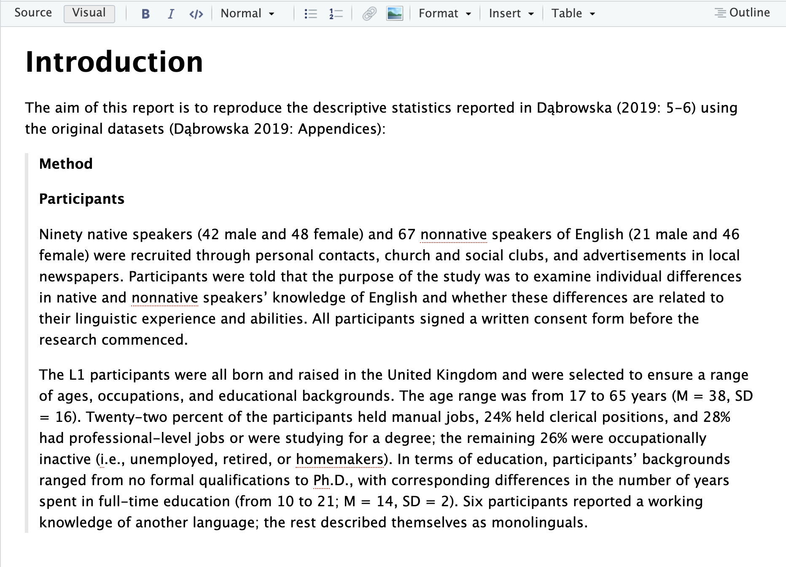
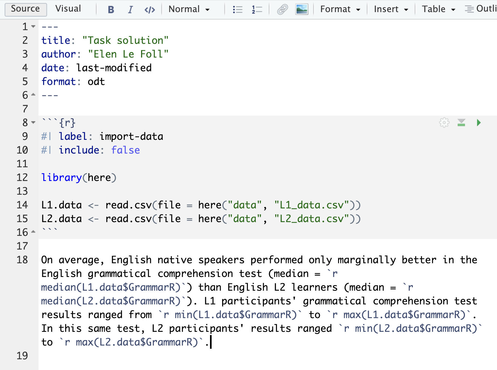
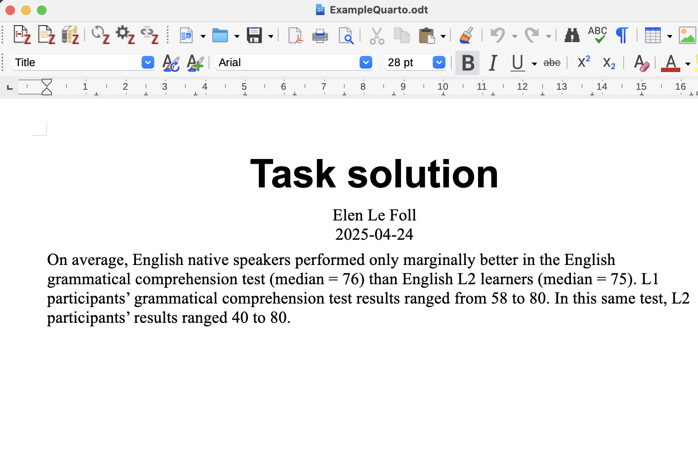

# Ch. 14: Tasks & Quizzes {.unnumbered}

::: {.callout-tip collapse="false"}
#### Your turn! {.unnumbered}

Watch this video from 2019, in which Garrett Grolemund (data scientist and instructor at RStudio) explains why **literate programming** is key to improving medical science, data science, and ultimately all empirical research endeavours. Be aware that everything that Garrett says about **R Markdown** is also true of **Quarto**.



[**Q14.1**]{style="color:green;"} What is meant by the replication crisis?[^14_literateprogramming-2]

```{r}
#| echo: false
#| label: "Q14.1"
library(checkdown)
check_question("The finding, and related shift in academic culture and thinking, that a large proportion of scientific studies published across different disciplines do not replicate.",
                 options = c("The finding, and related shift in academic culture and thinking, that a large proportion of scientific studies published across different disciplines do not replicate.",
                 "A set of good research practices based on fundamental principles: honesty, reliability, respect and accountability.",
                 "An approach that integrates external criticism by colleagues and peers into the research process.", 
                 "An aphorism describing the pressure researchers feel to publish academic manuscripts, often in high prestige academic journals, in order to have a successful academic career.",
                 "The application of statistical principles to arrive at well-founded —i.e. likely corresponding accurately to the real world— concepts, conclusions or measurement.",
                 "The tendency to report only significant results in the abstract, while reporting non-significant results within the main body of the manuscript (not reporting non-significant results altogether would constitute selective reporting)."), 
               random_answer_order = TRUE,
               q_id = "Q14.1", 
               type = "radio",
               button_label = "Check answer",
               right = "That's right! The other options are short definitions of the terms 'abstract bias', 'research integrity', 'red teams', 'validity', and 'publish or perish', taken from the FORRT glossary. Can you tell which is which? Check your intuition here: https://forrt.org/glossary/english/.",
               wrong = "No, that's not it.")
check_hint("The community-sourced FORRT glossary provides excellent, short definitions for many Open Science terms: https://forrt.org/glossary/english/.", hint_title = "🐭 Click on the mouse for a hint.")
```

[**Q14.2**]{style="color:green;"} Which stages of the research process are potential sources of uncertainty?

```{r}
#| echo: false
#| label: "Q14.2"

check_question(c("The choice of research questions",
                 "The sampling procedure",
                 "The measurement of variables",
                 "The handling of missing data",
                 "The choice of statistical tests/models",
                 "The handling of confounding variables",
                 "The publication process"),
                 options = c("The choice of research questions",
                 "The sampling procedure",
                 "The measurement of variables",
                 "The handling of missing data",
                 "The choice of statistical tests/models",
                 "The handling of confounding variables",
                 "The publication process"), 
               type = "check", 
               q_id = "Q14.2", 
               alignment = "vertical",
               button_label = "Check answer",
               right = "That's right and there are many more potential sources of uncertainty throughout the research cycle.",
               wrong = "Not quite. There are more potential sources of uncertainty")
check_hint("There are probably more sources of uncertainty than you might think of at first.", hint_title = "🐭 Click on the mouse for a hint.")
```

[**Q14.3**]{style="color:green;"} What would it take for a linguist to fully understand the conclusions of another linguist's quantitative study?

```{r}
#| echo: false
#| label: "Q14.3"

check_question(c("The original data from the study",
                 "The analysis code",
                 "The software used to run the code",
                 "A detailed report explaining the author's reasoning for the choices they made"),
                 options = c("The original data from the study",
                 "The analysis code",
                 "The software used to run the code",
                 "Remote access to the author's computer",
                 "A detailed report explaining the author's reasoning for the choices they made"), 
               type = "check", 
               q_id = "Q14.3", 
               alignment = "vertical",
               button_label = "Check answer",
               right = "That's right and that's when authoring formats such as R Markdown and Quarto come in very handy as they allow us to combine all of these things!" ,
               wrong = "No, not quite.")
check_hint("If you're unsure, re-watch the video from minute 13' onwards.", hint_title = "🐭 Click on the mouse for a hint.")
```
:::
::: {.callout-tip collapse="false"}
#### Your turn! {.unnumbered}

[**Q14.4**]{style="color:green;"} In this task, you will practice using *RStudio*'s Visual model to format text in a Quarto document.

-   In a new line beginning after the final `---` of the YAML header, paste the introduction text below.
-   Using the Quarto editing toolbar, format the text so that, in the Visual mode, it looks like the text displayed in the screenshot below.
-   Render the document and compare how it is formatted in the HTML version.

```{markdown}
Introduction

The aim of this report is to reproduce the descriptive statistics reported in Dąbrowska (2019: 5-6) using the original datasets (Dąbrowska 2019: Appendix S4):

Method

Participants

Ninety native speakers (42 male and 48 female) and 67 nonnative speakers of English (21 male and 46 female) were recruited through personal contacts, church and social clubs, and advertisements in local newspapers. Participants were told that the purpose of the study was to examine individual differences in native and nonnative speakers’ knowledge of English and whether these differences are related to their linguistic experience and abilities. All participants signed a written consent form before the research commenced.

The L1 participants were all born and raised in the United Kingdom and were selected to ensure a range of ages, occupations, and educational backgrounds. The age range was from 17 to 65 years (M = 38, SD = 16). Twenty-two percent of the participants held manual jobs, 24% held clerical positions, and 28% had professional-level jobs or were studying for a degree; the remaining 26% were occupationally inactive (i.e. unemployed, retired, or homemakers). In terms of education, participants’ backgrounds ranged from no formal qualifications to Ph.D., with corresponding differences in the number of years spent in full-time education (from 10 to 21; M = 14, SD = 2). Six participants reported a working knowledge of another language; the rest described themselves as monolinguals.
```



In *RStudio*'s visual mode, what is the name of the formatting option that indents and adds a grey line to the left of a quoted paragraph as in the screenshot above?

```{r}
#| echo: false
#| label: "Q14.4"

check_question("Blockquote",
                 options = c("Blockquote",
                 "Line Block",
                 "Code Block", 
                 "Div",
                 "Span"), 
               random_answer_order = TRUE,
               q_id = "Q14.4", 
               type = "radio",
               button_label = "Check answer",
               right = "That's right! The other options can also be found in the \"Format\" drop-down menu, but blockquote is correct.",
               wrong = "No, that's not it. Try these options out and these what effect they have.")
check_hint("All of these options can be found in RStudio's in the \"Format\" drop-down menu in the Visual mode.", hint_title = "🐭 Click on the mouse for a hint.")
```
:::
::: {.callout-note collapse="true"}
#### Click here for the full solution to [**Q14.4**]{style="color:green;"}

In the Visual mode (see @fig-QuartoVisual (a)), click on the "Normal" drop-down menu (see @fig-QuartoVisual (b)) to change the formatting of the word *Introduction* to the "Header 1" style. To format the long citation, choose the "Blockquote" option from the the "Format" drop-down menu (see @fig-QuartoVisual (c)).

{#fig-QuartoVisual width="442"}
:::
::: {.callout-tip collapse="false"}
#### Your turn! {.unnumbered}

Switch to the **Source mode** to view the text that you formatted in the Visual editor for [**Q14.4**]{style="color:green;"} in Markdown format.

[**Q14.5**]{style="color:green;"} How is text highlighted in bold displayed in Markdown?

```{r}
#| echo: false
#| label: "Q14.5"

check_question("**bold text**",
               options = c("**bold text**", 
                           "*bold text*", 
                           "# bold text", 
                           "[bold text]{.bold}",
                           "BOLD TEXT"), 
               type = "radio",
               q_id = "Q14.5", 
button_label = "Check answer",
random_answer_order = TRUE,
right = "That's right! 🎉",
wrong = "Hummm, are you sure? Go back to the Visual editor and format a word in bold there then switch back to the Source mode to see what happens.")
```

[**Q14.6**]{style="color:green;"} How is a first-level heading displayed in Markdown?

```{r}
#| echo: false
#| label: "Q14.6"

check_question("# Heading 1",
               options = c("**Heading 1**", 
                           "[*Heading 1*]", 
                           "# Heading 1", 
                           "<h1>Heading 1</h1>",
                           "HEADING 1"), 
               type = "radio",
               q_id = "Q14.6", 
button_label = "Check answer",
random_answer_order = TRUE,
right = "That's right! 🎉",
wrong = "Hummm, are you sure? How is the word \"Introduction\" formatted in your text?")
```

[**Q14.7**]{style="color:green;"} How are block quotes formatted in Markdown?

```{r}
#| echo: false
#| label: "Q14.7"

check_question("Every line begins with > followed by a space",
               options = c("Every line begins with >", 
                           "Every line begins with > followed by a tab", 
                           "Every line begins with > followed by a space", 
                           "The text is coloured green"), 
               type = "radio",
               q_id = "Q14.7", 
button_label = "Check answer",
random_answer_order = TRUE,
right = "That's right! 🎉",
wrong = "Hummm, are you sure? Go back to the Source code of your Quarto document and check out the formatting of a block quote.")
```

[**Q14.8**]{style="color:green;"} How will the word `~~mystery~~` be formatted in Markdown?

```{r}
#| echo: false
#| label: "Q14.8"

check_question("crossed-out",
               options = c("in italics", 
                           "as a subsection heading", 
                           "as computer code", 
                           "crossed-out",
                           "in grey"), 
               type = "radio",
               q_id = "Q14.8", 
button_label = "Check answer",
random_answer_order = TRUE,
right = "That's right! 🎉",
wrong = "Hummm, are you sure? Have you tried inserting `~~mystery~~` in the Source code of your Quarto document and then switching to the Visual editor to see what happens?")
```
:::
::: {.callout-tip collapse="false"}
#### Your turn! {.unnumbered}

In your Quarto document, add a label to your first `R` chunk and render your document to HTML.

```{r}
#| echo: fenced
#| label: setup

library(here)
library(tidyverse)
```

[**Q14.9**]{style="color:green;"} What is the output of the `setup` chunk in your rendered `.html` document?

```{r}
#| echo: false
#| label: "Q14.9"

check_question("Two messages, one per loaded library.",
               options = c("Nothing.", 
                           "Two messages, one per loaded library.", 
                           "A conflict error message.", 
                           "An error message beginning with: \"Error in `library()`: ! there is no package called...",
                           "An error message ending in: \"Execution halted\"."), 
               type = "check",
               q_id = "Q14.9", 
button_label = "Check answer",
right = "That's right! What you are seeing are messages that the {here} and the {tidyverse} libraries automatically output when they are correctly loaded. To find out more about conflicts, see Section 9.2.",
wrong = "Oh no, something's gone wrong... If you are getting the fourth error message, this means that your document could not be rendered because one of the two packages has not been installed yet. Install them and then try rendering your document again. Also, check that you have not misspelt the names of the packages! If you are getting the last error message, there is a problem with your Quarto document, which means that it cannot be rendered. Read the rest of the error message to understand where the problem lies. It is very likely to be a small syntax error or typo.") 
check_hint("Remember that a conflict message is *not* an error message, it merely informs us about potential conflicts when two different packages have functions with the same name (see Section 9.2).", 
           hint_title = "<br>🐭 Click on the mouse for a hint.")
```

[**Q14.10**]{style="color:green;"} Which code chunk option can you use to remove the two messages from the rendered version of your Quarto document, whilst still ensuring that the `setup` chunk is displayed and executed so that the libraries can be used in future code chunks?

```{r}
#| echo: false
#| label: "Q14.10"

check_question("#| message: false",
               options = c("#| message: false", 
                           "#| message: true", 
                           "#| messages: false", 
                           "#| eval: true",
                           "#| echo: false"), 
               type = "radio",
               q_id = "Q14.10", 
button_label = "Check answer",
random_answer_order = TRUE,
right = "That's right, well done!",
wrong = "No, not quite. Have you tried inserting this code chunk option in your Quarto document and then rendering it to see what happens?")
check_hint("Code chunk options are applied to the entire chunk, so in this case, the option will apply to the outputs of both loaded libraries.", 
           hint_title = "<br>🐭 Click on the mouse for a hint.")

```

[**Q14.11**]{style="color:green;"} Which code chunk option can you use to remove both the `setup` chunk and its outputs from the rendered version of your Quarto document, whilst still ensuring that the libraries are loaded so that their functions can be used further down in the document?

```{r}
#| echo: false
#| label: "Q14.11"

check_question("#| include: false",
               options = c("#| include: false", 
                           "#| display: false", 
                           "#| echo: false", 
                           "#| eval: false",
                           "#| echo: true"), 
               type = "radio",
               q_id = "Q14.11", 
button_label = "Check answer",
random_answer_order = TRUE,
right = "That's right, well done!",
wrong = "No, not quite. Have you tried inserting this code chunk option in your Quarto document and then rendering it to see what happens?")
check_hint("You may be tempted to choose `echo: false`, which will remove the code from the rendered document. However, this will also keep its outputs, which includes the messages that we do not want displayed in our rendered document.", 
           hint_title = "<br>🐭 Click on the mouse for a hint.")
```
:::
::: {.callout-tip collapse="false"}
#### Your turn! {.unnumbered}

[**Q14.12**]{style="color:green;"} In your Quarto document, add a code chunk called `L2-gender` in which you compute the values necessary to complete the missing descriptive statistics in the sentence above. When rendered, your sentence should read:

> 90 native speakers (42 male and 48 female) and 67 nonnative speakers of English (21 male and 46 female) were recruited through personal contacts, church and social clubs, and advertisements in local newspapers.

  Which value requires more than just one line of code?

```{r}
#| echo: false
#| label: "Q14.12"

check_question("The number of L2 female speakers",
                 options = c("The number of L2 female speakers",
                 "The number of L2 male speakers",
                 "The total number of L2 participants."), 
               random_answer_order = TRUE,
               q_id = "Q14.12", 
               type = "radio",
               button_label = "Check answer",
               right = "Well done for spotting the problem! Have you managed to solve it? If not, check the solution below.",
               wrong = "No, this value can be generated with a single R function. Check out the solution below to find out how to complete the task.")
check_hint("Check ", hint_title = "🐭 Click on the mouse for a hint.")
```
:::
::: {.callout-note collapse="true"}
#### Click here for the solution to [**Q14.12**]{style="color:green;"}

```{r}
#| include: false
library(here)
library(tidyverse)
L1.data <- read.csv(file = here("data", "L1_data.csv"))
L2.data <- read.csv(file = here("data", "L2_data.csv"))
```

To save the number of male L2 participants as an R object, we can follow the same procedure as above.

```{r}
L2.males <- L2.data |>  
  filter(Gender == "M") |>
  count()
```

For the number of female L2 participants, however, it's not so simple because some are labelled `f`, while others are labelled `F` (see @sec-across).

```{r}
table(L2.data$Gender)
```

Below are four possible methods to solve this issue (and there are many more still!):

```{r}
# Method 1:
L2.Females <- L2.data |> 
  filter(Gender == "F") |> 
  count()

L2.females <- L2.data |> 
  filter(Gender == "f") |> 
  count()

L2.allfemales <- L2.Females + L2.females 

# Method 2:
L2.allfemales <- L2.data |> 
  filter(Gender == "F" | Gender == "f") |> 
  count()

# Method 3:
L2.allfemales <- L2.data |> 
  filter(Gender %in% c("F", "f")) |> 
  count()

# Method 4:
L2.allfemales <- L2.data |> 
  mutate(Gender = toupper(Gender)) |> 
  filter(Gender == "F") |> 
  count()

```

Some of these methods are perhaps more elegant than others, but they are all acceptable. After all, they all work! 🙃

Once they are saved to the local environment, the values can be inserted inline in the usual way:

``` markdown

 `{{r}} nrow(L1.data)` native speakers (`{{r}} L1.males` male and `{{r}} L1.females` female) and `{{r}} nrow(L2.data)` nonnative speakers of English (`{{r}} L2.males` male and `{{r}} L2.allfemales` female) were recruited through personal contacts, church and social clubs, and advertisements in local newspapers. 
```
:::
::: {.callout-tip collapse="false"}
#### Your turn! {.unnumbered}

👩🏾‍💻 Copy the code and text sections corresponding to the description of participants' professional occupations and education displayed @sec-Inline (in the textbox "More complex inline computations") into your Quarto document and render it to HTML. Compare the values in your rendered document with the original ones from the published study (see below).

> "Twenty-two percent of the participants held manual jobs, 24% held clerical positions, and 28% had professional-level jobs or were studying for a degree; the remaining 26% were occupationally inactive (i.e. unemployed, retired, or homemakers). In terms of education, participants' backgrounds ranged from no formal qualifications to Ph.D., with corresponding differences in the number of years spent in full-time education (from 10 to 21; M = 14, SD = 2). Six participants reported a working knowledge of another language; the rest described themselves as monolinguals" [@DabrowskaExperienceAptitudeIndividual2019: 6].

[**Q14.13**]{style="color:green;"} Compare the rendered version of your document with the original descriptive statistics reported in Dąbrowska [-@DabrowskaExperienceAptitudeIndividual2019: 6]. Could you successfully **reproduce** these descriptive statistics? Which values are different?

```{r}
#| echo: false
#| label: "Q14.13"

check_question("None of them.",
                 options = c("None of them.",
                 "The values expressed in percentages.",
                 "The standard deviations.",
                 "The number of non-monolingual L1 participants."), 
               type = "check", 
               q_id = "Q14.13", 
               random_answer_order = TRUE,
               alignment = "vertical",
               button_label = "Check answer",
               right = "Great job! 💯",
               wrong = "Something's gone wrong... All the values should be actually be exactly the same.")
```
:::
::: {.callout-tip collapse="false"}
#### Your turn! {.unnumbered}

Using any of the methods described above, add an in-text bibliographic reference to the following article in your Quarto document:

> In'nami, Yo, Atsushi Mizumoto, Luke Plonsky & Rie Koizumi. 2022. Promoting computationally reproducible research in applied linguistics: Recommended practices and considerations. Research Methods in Applied Linguistics 1(3). 100030. https://doi.org/10.1016/j.rmal.2022.100030.

Specifically, we want to cite this passage from page 8:

> As implementing these steps may seem daunting, we recommend that researchers engage in reproducible research incrementally. That may be one small step for a researcher, but it will represent a giant leap for the field of applied linguistics when consolidated and accumulated in the long run.

[**Q14.14**]{style="color:green;"} If the key to this article in the `.bib` file is `innami2022`, which in-text citation can be used to cite this specific page within a Quarto document?

```{r}
#| echo: false
#| label: "Q14.14"

check_question("[@innami2022, p. 8]",
               options = c("[@innami2022, p. 8]",
                           "[@innami2022], p. 8]",
                           "([@innami2022], p. 8)"),
button_label = "Check answer",
q_id = "Q14.14", 
random_answer_order = TRUE,
type = "radio",
right = "That's right! 🎉",
wrong = "No, not quite.")
check_hint("You'll find detailed information on the formatting of in-text citations here: <https://quarto.org/docs/authoring/citations.html>.", hint_title = "🐭 Click on the mouse for a hint.")

```

Go to the [Zotero style repository](https://www.zotero.org/styles) and download the `.csl` citation stylesheet to format references according to the American Psychological Association (APA) 7^th^ edition. Link this stylesheet to your Quarto document and render to HTML.

[**Q14.15**]{style="color:green;"} Now that your document includes references formatted in APA7, how are the authors' names listed in your bibliography?

```{r}
#| echo: false
#| label: "Q14.15"

check_question("In’nami, Y., Mizumoto, A., Plonsky, L., & Koizumi, R.",
               options = c("In’nami, Y., Mizumoto, A., Plonsky, L., & Koizumi, R.", 
                           "In’nami, Yo, Atsushi Mizumoto, Luke Plonsky & Rie Koizumi", 
                           "In’nami et al.", 
                           "In’nami, Y., Mizumoto, A., Plonsky, L., and Koizumi, R.",
                           "In’nami, Yo, Atsushi Mizumoto, Luke Plonsky and Rie Koizumi"),
button_label = "Check answer",
q_id = "Q14.15", 
random_answer_order = TRUE,
type = "radio",
right = "Yes, well done! 👍",
wrong = "No, not quite. Citation styles can look very similar, but the devil is in the detail! 😈")
```
:::
::: {.callout-tip collapse="false"}
#### Your turn! {.unnumbered}

[**Q14.15**]{style="color:green;"} If you completed [**Q8.15**]{style="color:green;"} (@sec-Range), you copied-and-pasted a paragraph with gaps into LibreOffice Writer or Microsoft Word and then manually inserted descriptive statistics that you had calculated in `R`. This method of copying-and-pasting across different programmes is very error-prone: What if you accidentally pasted the wrong number in the wrong place? And what if there was an update to the dataset or you made some changes to the data cleaning procedure? You'd have to manually change all the numbers again! 🤯 This is time-consuming and, more worryingly, very likely to result in errors!

Now that you know about **literate programming** in Quarto, rewrite the following paragraph describing the `GrammarR` variable in `L1.data` and `L2.data` in Quarto. Use **in-text code chunks** to fill the gaps and then render your paragraph to `.docx` or `.odt` format to check the results.

> On average, English native speakers performed only marginally better in the English grammatical comprehension test (median = \_\_\_\_\_\_) than English L2 learners (median = \_\_\_\_\_\_). However, L1 participants' grammatical comprehension test results ranged from \_\_\_\_\_\_to \_\_\_\_\_\_, whereas L2 participants' results ranged from \_\_\_\_\_\_to \_\_\_\_\_\_.

 
:::
::: {.callout-note collapse="true"}
#### Click here for the solution to [**Q14.15**]{style="color:green;"}

Below is a screenshot of a Quarto document with the inline code chunks and its rendered `.odt` version as opened in LibreOffice Writer. You can click on the images to zoom in.

::: {layout-ncol="2"}
{fig-alt="The paragraph with inline code in Quarto reads: On average, English native speakers performed only marginally better in the English grammatical comprehension test (median = `r median(L1.data$GrammarR)`) than English L2 learners (median = `r median(L2.data$GrammarR)`). L1 participants' grammatical comprehension test results ranged from `r min(L1.data$GrammarR)` to `r max(L1.data$GrammarR)`. In this same test, L2 participants' results ranged `r min(L2.data$GrammarR)` to `r max(L2.data$GrammarR)`."}


:::
:::
### Check your progress 🌟 {.unnumbered}

Well done! You have successfully completed this chapter on literate programming using Quarto. You have answered [`r checkdown::insert_score()` out of 16 questions]{style="color:green;"} correctly.
