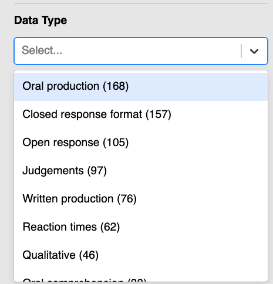

# Ch. 2: Tasks & Quizzes {.unnumbered}

::: {.callout-tip collapse="false"}
#### Your turn! {.unnumbered}

For these quiz questions and many future tasks, we will make use of the IRIS database.

-   Connect to the [IRIS website](https://iris-database.org/) and navigate to its [Search and Download](https://iris-database.org/search) page.
-   Scroll down to the filter option 'Data Type'.
-   Click on 'Data Type' and browse through the different data types that are most commonly used in language-related research.

{fig-alt="Data Type filter dropdown menu with the following visible categories: Oral production (168), Closed response format (157), Open response (105), Judgements (97), Written production (76), Reaction times (62), Qualitative (46)" width="250"}

[**Q2.1**]{style="color:green;"} For which kinds of studies could these different types of data have been collected? Think about both experimental and observational studies.

[**Q2.2**]{style="color:green;"} Which of these data types is most likely to be measured in milliseconds (ms)?

```{r}
#| echo: false
#| label: "Q2.2"
library(checkdown)
check_question(answer = c("Reaction times", "reaction times", "Reaction time", "Reaction Time", "Reaction Times", "reaction", "Reaction", "reaction time"), 
button_label = "Check answer",
q_id = "Q2.2", 
right = "Yes, well done!",
wrong = "No, check the list of data types on IRIS.")
```
:::
::: {.callout-tip collapse="false"}
#### Your turn! {.unnumbered}

[**Q2.3**]{style="color:green;"} Which other reasons could potentially jeopardise the comparison of test results data from two different groups of pupils?

```{r}
#| echo: false
#| label: "Q2.3"

check_question(c("The two groups having different teachers.", "One group having French lessons on Tuesday mornings, the other on Friday afternoons.", "One group having a higher proportion of pupils from migrant families.", "One group having a single native speaker of French, whilst the other has none.", "One group having a higher proportion of pupils with reading difficulties.", "One group having a classroom decorated with French flags and posters about France."), options = c("The two groups having different teachers.", "One group having French lessons on Tuesday mornings, the other on Friday afternoons.", "One group having a higher proportion of pupils from migrant families.", "One group having a single native speaker of French, whilst the other has none.", "One group having a higher proportion of pupils with reading difficulties.", "One group having a classroom decorated with French flags and posters about France."), type = "checkbox", 
random_answer_order = TRUE,
q_id = "Q2.3", 
button_label = "Check answer",
right = "That's right! All of these factors could potentially influence the outcome of this comparison study. <br><br>Can you think of ways to ensure that these factors are controlled for?",
wrong = "Not quite. There are more reasons.")
```
:::
::: {.callout-tip collapse="false"}
#### Your turn! {.unnumbered}

[**Q2.4**]{style="color:green;"} In which format are Microsoft Word files typically saved?

```{r}
#| echo: false
#| label: "Q2.4"

check_question(".docx", options = c(".odt", ".docx", ".docs", ".msword"), type = "radio", 
random_answer_order = TRUE,
button_label = "Check answer", q_id = "Q2.4",
right = "That's right! Though older versions of MS Word used the format `.doc`.",
wrong = "That's incorrect. Do you have a Word file on your computer whose file extension you could check?")
```

[**Q2.5**]{style="color:green;"} Which of these files are audio files?

```{r}
#| echo: false
#| label: "Q2.5"

check_question(c("dialogue001.mp3", "dialogue001.wav", "001_dialog.flac"), options = c("dialogue001.mp3", "dialogue001.wav", "dialog_01.csv", "001_dialog.flac", "DIALOGUE.audio"), type = "checkbox",
random_answer_order = TRUE,
button_label = "Check answer", q_id = "Q2.5",
right = "That's right!",
wrong = "Not quite.") 
check_hint("There are three audio files in this list.", 
           hint_title = "🐭 Click on the mouse for a hint.")
```
:::
::: {.callout-tip collapse="false"}
#### Your turn! {.unnumbered}

Imagine that you want to run an experiment similar to the one carried out in @schimkeFirstLanguageInfluence2018. You can reuse the Playmobil image files created by the researchers as they helpfully uploaded them to the IRIS database.

In which file format do you think the images are archived? To find out, click [here](https://iris-database.org/search/?s_publicationAPAInlineReference=Schimke%20et%20al.%20(2018)) to go directly to the list of data and materials associated with the study. There are four entries in the IRIS database that are associated with this study. Select the "Pictorial" entry which contains the images. It allows you to download a ZIP file called `Images_online.zip`. ZIP is an archive file format that can contain one or more compressed files. Download this ZIP file and decompress ('unzip') it. You should find that it contains a folder entitled 'Images', which contains 58 pictures of different combinations of Playmobil figures that correspond to the experiment's stimulus sentences.

[**Q2.6**]{style="color:green;"} In which file format are these Playmobil image files?

```{r}
#| echo: false
#| label: "Q2.6"

check_question("BMP", options = c("BMP", "GIMP", "JPEG", "PNG", "GIF"), type = "radio",
q_id = "Q2.6",            
button_label = "Check answer",
right = "That's right!",
wrong = "This is an image file format, but these Playmobil images are not saved in this format.")
```

Image files typically contain metadata that is embedded in the image files themselves. This metadata may include the dimensions of the image and its colour profile. To view this metadata, right-click on one of the image files that you have extracted from the ZIP file and select the option to get more information about the file, e.g. "Get Info" or "Properties".

[**Q2.7**]{style="color:green;"} How wide are these Playmobil images in pixel?

```{r}
#| echo: false
#| label: "Q2.7"

check_question("1024",
button_label = "Check answer",
q_id = "Q2.7", 
right = "That's right, well done!",
wrong = "No. Image dimensions are usually displayed as two numbers separated by an \"x\" symbol. As these Playmobil images are all in landscape format so that the larger number corresponds to the width of the images.")
```
:::
::: {.callout-tip collapse="false"}
#### Your turn! {.unnumbered}

In this [**task**]{style="color:green;"}, we will practice opening a DSV file in LibreOffice Calc. Our example file is a real dataset from @schimkeFirstLanguageInfluence2018. We will begin by downloading it from the public repository [IRIS](https://iris-database.org/search/?s_publicationAPAInlineReference=Schimke%20et%20al.%20(2018)).

In addition to the eye-tracking experiments, @schimkeFirstLanguageInfluence2018 conducted two further experiments in which participants completed a gap-filling task via an online survey platform. In the first of these experiments, the participants were native (L1) speakers of French, German, and Spanish. In the second, they were French- and Spanish-speaking learners (L2) of German.

In both experiments, the L1 and L2 participants were shown ambiguous sentences similar to the ones used in the eye-tracking experiment with the Playmobil images (see @nte-Eyetracking). After having read each stimulus, the participants were asked to complete a gap-fill task according to their understanding of the preceding ambiguous sentence. Participants were told "that there were no incorrect responses and that they should answer spontaneously" [@schimkeFirstLanguageInfluence2018: 755]. Below is an example questionnaire item in the three languages examined:

<div>

> 1\. *Der Briefträger ist dem Straßenfeger begegnet, bevor er schnell ein Sandwich geholt hat. \_\_\_\_\_\_\_\_\_\_\_\_\_\_\_\_\_\_\_ hat ein Sandwich geholt.*
>
> 2\. *Le facteur a rencontré le balayeur avant qu'il prenne rapidement un sandwich. \_\_\_\_\_\_\_\_\_\_\_\_\_\_\_\_\_\_\_ a pris un sandwich.*
>
> *3a. El cartero se reunió con el barrendero antes de que él recogiera velozmente un emparedado. \_\_\_\_\_\_\_\_\_\_\_\_\_\_\_\_\_\_\_ recogió un emparedado.*
>
> 3b. *El cartero se reunió con el barrendero antes de que recogiera velozmente un emparedado. \_\_\_\_\_\_\_\_\_\_\_\_\_\_\_\_\_\_\_ recogió un emparedado.*

</div>

Note that, for Spanish, there were two types of stimuli: one with an overt pronoun (as in 3a. with *él*) and one without (as in 3b. with a null pronoun), as both variants are possible in Spanish. All three examples translate as:

> -   *The postman encountered the street sweeper before he quickly fetched a sandwich. \_\_\_\_\_\_\_\_\_\_\_\_\_\_\_\_\_\_\_ fetched a sandwich.*

To complete the gap, participants could either select 'The postman' or 'The street sweeper'.

1.  Go back to the study's page on [IRIS](https://iris-database.org/search/?s_publicationAPAInlineReference=Schimke%20et%20al.%20(2018)) and select the second entry entitled 'Other questionnaire' which, among other things, contains 'Written production data'.

Note that this database entry includes both research data and research materials: the file `sentences_offline_task.xlsx` contains the full list of questionnaire items, including both experimental and filler items, with which we could reconstruct the experiment to replicate it with a new set of participants. For now, however, we are not interested in obtaining materials to replicate the study, but rather in examining the study's original data.

This [IRIS entry](https://iris-database.org/details/lYT9m-a75tV) also contains three data files. The last file (`logoddslearnersfinal.txt`) is the DSV file that was used to create @tbl-EyeTrackingTable above.

In this [**task**]{style="color:green;"}, we are going to look at the questionnaire data corresponding to the gap-filling task experiment conducted with German L2 learners, which is contained in the data file `offlinedataLearners.txt`:

2.  Download the `offlinedataLearners.txt` file (which is the second listed) and save it on your computer (see @sec-FoldersPaths).
3.  Launch LibreOffice (see @sec-OpenSource if you have not yet installed LibreOffice) and, from the list of options under 'Create', click on 'Calc Spreadsheet' to open up a blank spreadsheet.
4.  From the 'File' drop-down menu, select 'Open...' or use the keyboard shortcut 'Ctrl/Cmd + O'. Find `offlinedataLearners.txt` in the folder where you saved it and click on 'Open'.
5.  A 'Text Import' dialogue box will pop up. This a DSV file, not a fixed-width file, so ensure that the option 'Separated by' is selected. If not already set by default, it is also a good idea to select 'Unicode (UTF-8)' for the 'Character set'.
6.  Experiment with the different 'Separator Options' until the preview at the bottom of the dialogue box looks like a table.
7.  Ensure that, apart from the 'Separator Options', all other options in the dialogue box are unselected and then click on 'OK'.

[**Q2.8**]{style="color:green;"} What is the separator character in the file `offlinedataLearners.txt`?

```{r}
#| echo: false
#| label: "Q2.8"

check_question("Tab", options = c("Tab", "Comma", "Semicolon", "Space", "All of them"), type = "radio", 
random_answer_order = FALSE,
q_id = "Q2.8", 
button_label = "Check answer",
right = "That's right!",
wrong = "That's incorrect. Try selecting the other separators options in the \"Text Import\" dialogue box until the preview of the table looks like a table.")
```

[**Q2.9**]{style="color:green;"} What is the delimiter character in the file `offlinedataLearners.txt`?

```{r}
#| echo: false
#| label: "Q2.9"

check_question("There is none.", options = c("\"", "\'", "There is none.", "Both \" and \'"), type = "radio", 
random_answer_order = TRUE,
q_id = "Q2.9", 
button_label = "Check answer",
right = "That's right! This particular DSV file does not use a string delimiter.",
wrong = "Not quite. Try opening the file in a plain-text editor or text-processing program to find out.")
```

[**Q2.10**]{style="color:green;"} How many observations does the file `offlinedataLearners.txt` contain?

```{r}
#| echo: false
#| label: "Q2.10"

check_question("700", options = c("700", "701", "5", "3500", "3505"), type = "radio", 
random_answer_order = TRUE,
q_id = "Q2.10", 
button_label = "Check answer",
right = "That's right! Each observation corresponds to a row. And there is an additional row for the column headers.",
wrong = "No. In this table, each observation corresponds to a row. And there is an additional row for the column headers.")
```

[**Q2.11**]{style="color:green;"} In this table, what does each observation correspond to?

```{r}
#| echo: false
#| label: "Q2.11"

check_question("A single participant\'s response to a single sentence gap.", options = c("A single participant\'s response to a single sentence gap.", "All the responses from a single participant.", "All the responses to a single sentence in a single language.", "All the responses in a single language."), type = "checkbox", 
random_answer_order = TRUE,
q_id = "Q2.11",
button_label = "Check answer",
right = "That's right!",
wrong = "I'm afraid not.")
```
:::
::: {.callout-tip collapse="false"}
#### Your turn! {.unnumbered}

In this [**task**]{style="color:green;"}, you will find out how genetics researchers who use spreadsheets for their analyses regularly have their data so badly damaged that it affects the results of their publication. Though we have no statistics on how spreadsheet errors affect the work of linguists, it is (unfortunately) very likely to be just as bad as in genetics.

@ziemannGeneNameErrors2016 reported that a fifth of genetics publications with supplementary `.xls` or `.xlsx` files with gene lists contained errors caused by Excel's auto-formatting behaviour. The results of this study shocked the research community and a report about it went viral. Click on the link below to read the open-access article "Gene name errors: Lessons not learnt" by @abeysooriyaGeneNameErrors2021 to find out whether the situation has improved since 2016 and answer the questions below.

> Abeysooriya, Mandhri, Megan Soria, Mary Sravya Kasu & Mark Ziemann. 2021. Gene name errors: Lessons not learned. PLOS Computational Biology. Public Library of Science 17(7). e1008984. <https://doi.org/10.1371/journal.pcbi.1008984>.

[**Q2.12**]{style="color:green;"} Has the proportion of genetics publications with Excel gene lists affected by auto-formatting errors decreased since 2016?

```{r}
#| echo: false
#| label: "Q2.12"

check_question("No, it has remained stable.", options = c("No, it has remained stable.", "No, it increased between 2016 and 2020.", "Yes, it decreased between 2016 and 2020."), 
type = "radio",
q_id = "Q2.12", 
random_answer_order = TRUE,
button_label = "Check answer",
right = "That's right: Even though the first widely-read report about this was published in 2016, it was just as bad a problem in 2020!",
wrong = "No. Take another look at Fig. 1C from the paper.")
```

[**Q2.13**]{style="color:green;"} Does using LibreOffice Calc (see @sec-OpenSource) also cause these same issues?

```{r}
#| echo: false
#| label: "Q2.13"

check_question("No, but whilst LibreOffice is better than Excel or Google Sheets, it is still less than ideal for data analysis.", options = c("No, but whilst LibreOffice is better than Excel or Google Sheets, it is still less than ideal for data analysis.", "Yes, LibreOffice is just as likely to cause such errors.", "No, if you cannot afford Excel, then LibreOffice Calc is an excellent open-source alternative."), type = "radio", 
random_answer_order = TRUE,
q_id = "Q2.13", 
button_label = "Check answer",
right = "That's right. Abeysooriya et al. (2021) found that LibreOffice and Gnumeric did not convert gene names to dates automatically, which means that they are safer to use than Excel or Google Sheets. However, other issues may still occur and the authors conclude that it is best to use R or Python for data analysis.",
wrong = "Not quite.")
```

[**Q2.14**]{style="color:green;"} Did highly reputable journals publish fewer articles with erroneous Excel gene lists?

```{r}
#| echo: false
#| label: "Q2.14"

check_question("No, they published more.", options = c("No, they published more.", "Yes, they published fewer.", "No, publications with problematic Excel files were found in more or less equal proportions in all journals."), 
type = "radio",
q_id = "Q2.14", 
random_answer_order = TRUE,
button_label = "Check answer",
right = "Yes, that's right. The authors explain why they think that's the case in the discussion section of the paper.",
wrong = "No. Re-read the section on the correlation between journal impact factor and error proportion.")

```
:::
### Check your progress 🌟 {.unnumbered}

You have successfully completed [`r checkdown::insert_score()` out of 14 questions]{style="color:green;"} in this chapter.
