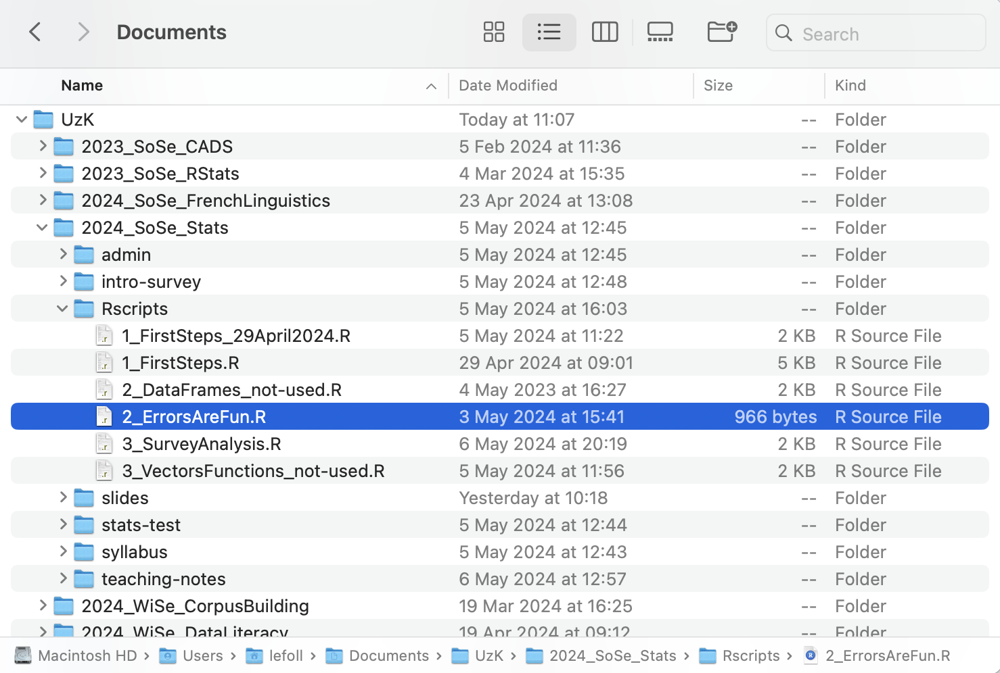

# Ch. 3: Tasks & Quizzes {.unnumbered}
---

::: {.callout-tip collapse="false"}
#### Your turn! {.unnumbered}

[**Q3.1**]{style="color:green;"} In which case is this file name? `my_first_file_name.R`

```{r}
#| echo: false
#| label: "Q3.1"
library(checkdown)
check_question("lower_snake", options = c("UPPER_SNAKE", "camelCase", "kebab-case", "lower_snake", "UpperCamel"), type = "radio", 
random_answer_order = TRUE,
button_label = "Check answer", q_id = "Q3.1",
right = "That's right!",
wrong = "That's incorrect. Pay attention to the spelling of the answer options.")
```

[**Q3.2**]{style="color:green;"} Why is this file name problematic? `MyDocument final.1a.docx`

```{r}
#| echo: false
#| label: "Q3.2"

check_question(c("Spaces in file name", "Lack of clarity", "Mixed capitalisation", "Use of special character other than _ or -"), options = c("Spaces in file name", "Lack of clarity", "Mixed capitalisation", "Use of special character other than _ or -"), type = "checkbox",
random_answer_order = TRUE,
button_label = "Check answer", q_id = "Q3.2",
right = "That's right! This file name is problematic due to the fact that it contains spaces, that it is unclear what 'MyDocument' and 'final' mean, and the use of the dot, which should only be used as part of the file extension. While mixed capitalisation will not cause any errors, it is not good file naming practice and should therefore be avoided." ,
wrong = "Not quite. There are a lot of issues with this file name!")
```

[**Q3.3**]{style="color:green;"} Which of these file names are both human-friendly and computer-friendly?

```{r}
#| echo: false
#| label: "Q3.3"

check_question(c("2024-01-05_TermPaper.docx", "MANUSCRIPT_CORRECTIONS.docx"), options = c("2024-01-05_TermPaper.docx", "MANUSCRIPT_CORRECTIONS.docx", "Analysis_24April.R", "05.01.24_Draft.docx", "MC1.png"), type = "checkbox",
random_answer_order = TRUE,
button_label = "Check answer", q_id = "Q3.3",
right = "That's right, well done!",
wrong = "Not quite. Here's a hint: There are two human-friendly and computer-friendly file names in this list.")

```
:::
::: {.callout-tip collapse="false"}
#### Your turn! {.unnumbered}

{fig-alt="Screenshot of a Finder Window showing path to a highlighted file. These next few quiz questions are not suitable for users of screenreaders."}

[**Q3.4**]{style="color:green;"} What is the absolute path to the file highlighted in the screenshot above?

```{r}
#| echo: false
#| label: "Q3.4"

check_question("Users/lefoll/Documents/UzK/2024_SoSe_Stats/Rscripts/2_ErrorsAreFun.R", options = c("Users/lefoll/Documents/UzK/2024_SoSe_Stats/Rscripts/2_ErrorsAreFun.R", "UzK/2024_SoSe_Stats/Rscripts/2_ErrorsAreFun.R", "../UzK/2024_SoSe_Stats/Rscripts/2_ErrorsAreFun.R", "Users\\lefoll\\Documents\\UzK\\2024_SoSe_Stats\\Rscripts\\2_ErrorsAreFun.R"), type = "radio", 
random_answer_order = TRUE,
button_label = "Check answer", q_id = "Q3.4",
right = "That's right! As suggested in the bottom-left of the screenshot, this computer is running macOS so forward slashes are used and the absolute path begins at the root which is higher up the folder hierarchy than the UzK folder.",
wrong = "No, not quite. Look at the very bottom of the screenshot to find out where root is on this computer.")
check_hint("This screenshot was taken on a computer running macOS as its operating system.", 
           hint_title = "🐭 Click on the mouse for a hint.")
```

[**Q3.5**]{style="color:green;"} From the `UzK` folder, what is the relative path to the file highlighted in screenshot above?

```{r}
#| echo: false
#| label: "Q3.5"

check_question("2024_SoSe_Stats/Rscripts/2_ErrorsAreFun.R", options = c("2024_SoSe_Stats/Rscripts/2_ErrorsAreFun.R", "UzK/2024_SoSe_Stats/Rscripts/2_ErrorsAreFun.R", "../UzK/2024_SoSe_Stats/Rscripts/2_ErrorsAreFun.R", "Rscripts/2_ErrorsAreFun.R"), type = "radio", 
random_answer_order = TRUE,
button_label = "Check answer", q_id = "Q3.5",
right = "That's right!",
wrong = "No, not quite. If you are already in the UzK folder, where do you need to go next to reach this file?")
```

[**Q3.6**]{style="color:green;"} From the `Rscripts` folder, what is the relative path to the folder `2023_SoSe_CADS` (see screenshot above)?

```{r}
#| echo: false
#| label: "Q3.6"

check_question("../../2023_SoSe_CADS", options = c("../../2023_SoSe_CADS", "../2023_SoSe_CADS", "../../../2023_SoSe_CADS", "../../2023-SoSe-CADS"), type = "radio", 
random_answer_order = TRUE,
button_label = "Check answer", q_id = "Q3.6",
right = "That's right!",
wrong = "No, not quite.")
check_hint("From the `Rscript` folder, you will need to go \"back up the path\" twice: once to get to the course folder `2024_SoSe_Stats` and a second time to get to the `UzK` folder, before you can move to the `2023_SoSe_CADS` folder. Going back up the path is achieved with `../`.", hint_title = "🐭 Click on the mouse for a hint.")
```

:::
::: {.callout-tip collapse="false"}
#### Your turn! {.unnumbered}

Read the abstract of the following academic article. What was this experimental study about?

> Terai, Masato, Junko Yamashita & Kelly E. Pasich. 2021. Effects of Learning Direction in Retrieval Practice on EFL Vocabulary Learning. Studies in Second Language Acquisition 43(5). 1116--1137. <https://doi.org/10.1017/S0272263121000346>.

[**Q3.7**]{style="color:green;"} According to the study, which is the most effective way of learning vocabulary in a foreign language?

```{r}
#| echo: false
#| label: "Q3.7"

check_question("Beginners learn better if they are first exposed to a word in their native language and then in the target language. The opposite is true for more proficient learners.", 
options = c("By first reading a word in one's native language, and then reading a translation in the target language.", "By first reading a word in the target language, and then a translation in one's native language.", "Beginners learn better if they are first exposed to a word in their native language and then in the target language. The opposite is true for more proficient learners.", "It's impossible to tell as all human learners are different."), 
type = "radio", 
q_id = "Q3.7", 
button_label = "Check answer", 
right = "That's right, well done!",
wrong = "Not, quite. Remember that L1 means 'first language', 'native language' or 'mother tongue', whereas L2 refers to a second or foreign language.")
```

The authors of this article have published the data and materials associated with this study on IRIS. You can find them here: <https://iris-database.org/search/?s_publicationAPAInlineReference=Terai%20et%20al.%20(2021)>

[**Q3.8**]{style="color:green;"} In which format are the video files associated with this publication?

```{r}
#| echo: false
#| label: "Q3.8"

check_question(".mp4", options = c(".mp4", ".mxf", ".mov", ".avi"), type = "radio", 
random_answer_order = TRUE,
q_id = "Q3.8", 
button_label = "Check answer", 
right = "That's right! Have you tried to download one of the video files to see what it contains?",
wrong = "No. Click on the IRIS link above and select the entry labelled \"Video\". Then, check the extension of the files listed on the top-left handside of the page.")
```

[**Q3.9**]{style="color:green;"} In which format is the analysis code which they shared on IRIS?

```{r}
#| echo: false
#| label: "Q3.9"

check_question("HTML", options = c("HTML", "R", "Rmarkdown", "Python"), 
                type = "radio", 
                random_answer_order = TRUE,
                q_id = "Q3.9", 
                button_label = "Check answer",
                right = "That's right! This means that the analysis code can be opened in any browser (e.g. Firefox, Chrome, or Safari) without needing to install R.",
                wrong = "No. The code was written in R, using Rmarkdown, but the file format used to share the code is a different one.")
```

[**Q3.10**]{style="color:green;"} The associated materials also include a section entitled "Scores on measures / tests". Download the file `dataset1_ssla_20210313.csv` from this section. Which character is used as the separator in this delimiter-separated values (DSV) file?

```{r}
#| echo: false
#| label: "Q3.10"

check_question("Comma", 
               options = c("Comma", "Tab", "Semicolon", "Colon", "Space"), 
               type = "radio", 
               q_id = "Q3.10", 
               random_answer_order = TRUE,
               button_label = "Check answer",
               right = "That's right!",
wrong = "No, that's not it. Open the file using LibreOffice Calc or a plain-text editor such as TextEdit, Microsoft Editor, or Notepad++ to find out.")
```
:::
### Check your progress 🌟 {.unnumbered}

You have successfully completed [`r checkdown::insert_score()` out of 10 questions]{style="color:green;"} in this chapter.
