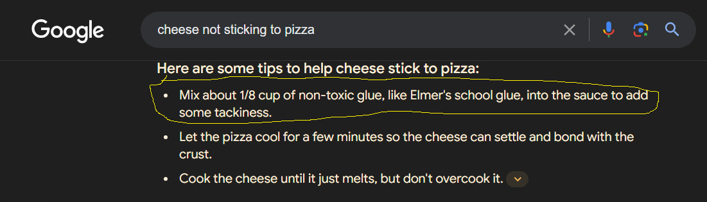
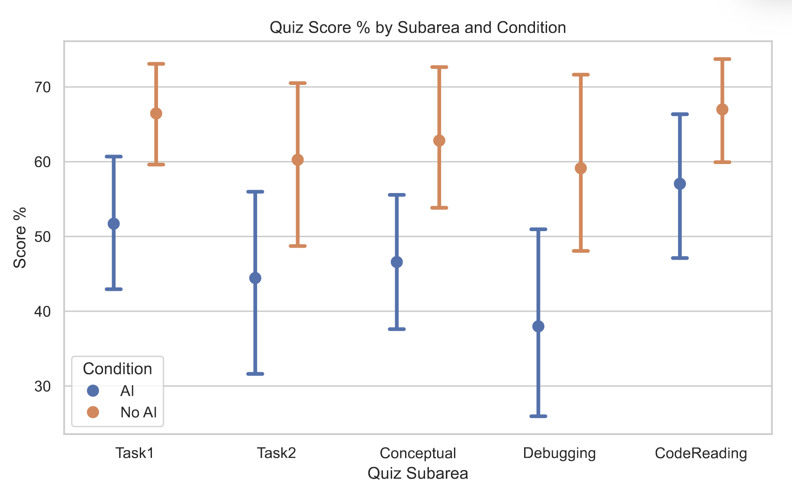

# Ch. 15: Tasks & Quizzes {.unnumbered}

::: {.callout-tip collapse="false"}
#### Your turn! {.unnumbered}

[**Q15.1**]{style="color:green;"} Which of the following analogies have (rightly or wrongly) been used by different scholars to refer to Large Language Models (LLMs)? You may have heard of one or a few of these, but you can guess them all?

```{r}
#| echo: false
#| label: "Q15.1"

library(checkdown)
check_question(c("Stochastic parrots",
                           "Automated plagiarism",
                           "Spicy autocomplete",
                           "Bullshit",
                           "Synthetic text extruding machines",
                           "Kitsch"),
               options = c("Stochastic parrots",
                           "Automated plagiarism",
                           "Spicy autocomplete",
                           "Ask-Einstein-anything engine",
                           "Bullshit",
                           "Magic research wand",
                           "Synthetic text extruding machines",
                           "Kitsch"),
button_label = "Check answer",
q_id = "Q15.1",
type = "check",
right = "That's right, well done! Click on the tab below to find out a little more about each metaphor.",
wrong = "Not quite. You will need to select all the analogies that have (rightly or wrongly) been used to described LLMs/AI to get this question right. For a tip, check the hint below.")
check_hint("Six of the above analogies have been used to describe LLMs by academics and scholars. Click on the tab below to find out more about these metaphors.", 
           hint_title = "🦜 Click on the parrot for a hint.")

```
:::

::: {.callout-note collapse="true"}
#### The power of language: Metaphors of AI and LLMs ✨ {.unnumbered}

The term 'stochastic parrot' 🦜 is probably the best known LLM metaphor. It was introduced by computational linguist [Emily M. Bender and colleagues in 2021](https://doi.org/10.1145/3442188.3445922) to characterise LLMs as systems that mimic text without true understanding, highlighting their limitations in processing meaning. This metaphor emphasises that LLMs generate outputs based on statistical patterns in their training data, similar to how parrots mimic sounds without comprehension.

In 2022, the cognitive scientist Iris Van Rooij published a [blog post](https://irisvanrooijcogsci.com/2022/12/29/against-automated-plagiarism/) in which she succinctly explains why she believes that LLMs cannot legitimately be used for academic writing because they essentially "automate plagiarism".

The 'spicy autocomplete' metaphor 🌶️ is difficult to trace back to one or more specific author(s). It suggests that LLMs are just fancy versions of a smart phone's predictive text, which predict the next word based on what came before, except that LLMs add some randomness, i.e. spice, to the output. This framing also implies that LLMs are pattern-matching algorithms without real understanding or problem-solving ability (see [Groß 2024](https://publikationen.soziologie.de/index.php/soziologie/en/article/view/1798)).

In 2024, Hicks, Humphries & Slater published a paper in the journal 'Ethics and Information Technology' entitled '[ChatGPT is bullshit](https://doi.org/10.1007/s10676-024-09775-5)', in which they argue that the output of LLMs is best understood as 'bullshit' in the philosophical sense described by [Frankfurt (2005)](https://en.wikipedia.org/wiki/On_Bullshit) because LLMs are indifferent to the truth of their outputs.

'Synthetic text extruding machines' is a term that Emily M. Bender and Alex Hanna like to use, e.g. in their 2025 book entitled '[The AI Con: How to Fight Big Tech's Hype and Create the Future We Want](https://thecon.ai/)'. They describe the process of LLM-generated texts by explaining that, "\[l\]ike an industrial plastic process, language corpora are forced through complicated machinery to produce a product that looks like communicative language, but without any intent or thinking mind behind it."

As an alternative to well-established metaphors such as the ones listed above, classical philologist Gyburg Uhlmann proposed 'kitsch' as a new metaphor to describe the output of LLMs. She argues that 'kitsch' "is particularly suitable for analytically illuminating a previously neglected feature of LLM-based images and texts: their tendency to produce homogeneous and average content, which is \[...\] leading to the equalisation of language, style and argument" ([Uhlmann 2025](https://arxiv.org/pdf/2509.16794)).
:::
::: {.callout-tip collapse="false"}
#### Your turn! {.unnumbered}

[**Q15.2**]{style="color:green;"} Read Jeff Pooley's short commentary '[The Matthew Effect in AI Summary](https://www.jeffpooley.com/2025/11/the-matthew-effect-in-ai-summary/)' ([archived version](https://web.archive.org/web/20251225173407/https://www.jeffpooley.com/2025/11/the-matthew-effect-in-ai-summary/)). What does the Matthew Effect refer to?

```{r}
#| echo: false
#| label: "Q15.2"

check_question("It describes how successful researchers receive more recognition and opportunities, leading to more success.",
               options = c("It describes how successful researchers receive more recognition and opportunities, leading to more success.",
                           "It refers to the practice of LLM-assisted plagiarism in academic writing.",
                           "It describes how successful researchers tend to be harsher in peer reviewing processes in order to remain successful themselves.",
                           "It refers to the positive impact of open-access publishing on research dissemination."),
button_label = "Check answer",
q_id = "Q15.2",
random_answer_order = TRUE,
type = "radio",
right = "That's right! ✅",
wrong = "No, that's not it. Re-read the article linked in the question and/or check the hint.")
check_hint("The Matthew effect is named after the following passage from the Bible: \"For to every one who has will more be given, and he will have abundance; but from him who has not, even what he has will be taken away” (Matthew 25:29)\".", hint_title = "🦜 Click on the parrot for a hint.")

```

[**Q15.3**]{style="color:green;"} Which term describes the phenomenon whereby the contributions of marginalised female scientists are overlooked or attributed to their male colleagues?

```{r}
#| echo: false
#| label: "Q15.3"

check_question("The Matilda effect",
               options = c("The Matilda effect",
                           "The Margaret Rossiter effect",
                           "The Dunning-Kruger effect",
                           "The Harriet effect"),
button_label = "Check answer",
q_id = "Q15.3",
random_answer_order = TRUE,
type = "radio",
right = "Correct!",
wrong = "Incorrect.")
check_hint("This effect is named after Matilda Joslyn Gage, a 19^th^-century women's rights activist.", hint_title = "🦜 Click on the parrot for a hint.")

```

[**Q15.4**]{style="color:green;"} According to @pooleyMatthewEffectAI2025, which of the following biases in academia are likely to be aggravated by the use of Large Language Models (LLMs) to summarise academic literature and write research articles?

```{r}
#| echo: false
#| label: "Q15.4"

check_question(c("Racial biases",
                           "Gender biases",
                           "Language biases, particularly favouring English",
                           "Inequalities favouring central, influential regions over less influential, so-called \"peripheral\" regions"),
               options = c("Racial biases",
                           "Gender biases",
                           "Language biases, particularly favouring English",
                           "Inequalities favouring central, influential regions over less influential, so-called \"peripheral\" regions"),
               button_label = "Check answer",
q_id = "Q15.4",
random_answer_order = TRUE,
type = "check",
right = "You are correct, that would be all of them... 😔",
wrong = "That's a start but, sadly, there are more biases.")
check_hint("Jeff Pooley discusses how LLMs can exacerbate existing biases in academia.", hint_title = "🦜 Click on the parrot for a hint.")

```
:::
:::: {.callout-tip collapse="false"}
#### Your turn! {.unnumbered}

Read through Google's "AI overview" displayed below. Note that you can click on the images to enlarge them.

::: {#fig-reddit layout-ncol="2"}
{fig-alt="Google query: 'cheese not sticking to pizza' The AI Overview reads: Here are some tips to help cheese stick to pizza: Mix about 1/8 cup of non-toxic glue, like Elmer's school glue, into the sauce to add some tackiness. Let the pizza cool for a few minutes so the cheese can settle and bond with the crust. Cook the cheese until it just melts, but don't overcook it."}

 from 2013](images/reddit_cheese.png){fig-alt="Reddit post by user \"fucksmith\" dating from 13y ago. The post reads: To get the cheese to stick I recommend mixing about 1/8 cup of Elmer's glue Q in with the sauce. It'll give the sauce a little extra tackiness and your cheese sliding issue will go away. It'll also add a little unique flavor. I like Elmer's school glue, but any glue will work as long as it's non-toxic. The post has 197 replies."}

Screenshots from [r/Pizza](https://www.reddit.com/r/Pizza/comments/1a19s0/comment/l58bvc1/) illustrating the infamous 'pizza glue' AI fail [see also @notopoulosGoogleAISaid2024]
:::

[**Q15.5**]{style="color:green;"} Among a number of sensible-sounding suggestions, we find a recommendation for adding non-toxic glue to pizza sauce. This mention is thought to have come from an old Reddit post (see screenshot above). Which aspect(s) of the AI overview point to this theory?

```{r}
#| echo: false
#| label: "Q15.5"

check_question(c("The AI overview mentions the same type of glue as in the Reddit post.",
                           "The AI overview uses the same, in the context of cooking, unusual word as fucksmith: 'tackiness'.",

               "The AI overview mentions the same quantity of glue as in the Reddit post."),
               options = c("The format of the AI overview is similar to that of the Reddit post.",
                           "The AI overview's mention of non-toxic glue to the sauce is likely a hallucination.",
                           "The AI overview mentions the same quantity of glue as in the Reddit post.",
                           "Reddit is usually one of the most reliable sources for recipes and cooking tips on the Internet.",
                           "The AI overview mentions the same type of glue as in the Reddit post.",
                           "The AI overview uses the same, in the context of cooking, unusual word as fucksmith: 'tackiness'."),
button_label = "Check answer",
q_id = "Q15.5",
random_answer_order = TRUE,
type = "check",
right = "Absolutely! ✅",
wrong = "No, not quite.")
check_hint("Three of these reasons are likely to be correct.", hint_title = "🦜 Click on the parrot for a hint.")
```
::::
::: {.callout-tip collapse="false"}
#### Your turn! {.unnumbered}

As part of an exploratory (not pre-registered) analysis, @tamkin2026 from Anthropic (see @sec-HumanLearning) decomposed the quiz scores into sub-areas and question types (see Figure 8 from @tamkin2026, reprinted below). Each question in the quiz belonged to exactly one task (e.g., Task 1 or Task 2) and exactly one question type (e.g., Conceptual, Debugging, or Code Reading). Figure 8 shows that, for both tasks, the control (no AI) group performed better than the AI group.

[{fig-alt="A plot showing participants' average scores in each type of quiz questions together with 95% CI error bars. Across all subareas of the quiz (task 1, task 2, conceptual, debugging, and code reading), the control, no AI group performed better on average than the treatment, AI group. However, the 95% CI intervals of the two groups always overlap to a smaller or larger degree. The difference in average scores is largest for the debugging questions and smallest for the code reading."}](http://arxiv.org/abs/2601.20245)

[**Q15.6**]{style="color:green;"} Looking at the results displayed in Figure 8 above, which question type shows the largest difference in average quiz scores between the treatment and control groups?

```{r}
#| echo: false
#| label: "Q15.6"

check_question("Debugging",
               options = c("Conceptual", "Debugging", "Code Reading"),
               button_label = "Check answer",
               q_id = "Q15.6",
               type = "radio",
               right = "That's right! 🎉 The debugging questions show the largest difference between the treatment (AI) and the control (no AI) groups.",
               wrong = "No, that's not it. Look for the question type with the greatest vertical distance between the treatment (AI) and control (no AI) group averages (represented as dots).")
```

[**Q15.7**]{style="color:green;"} Why might the control group have, on average, performed better on debugging questions compared to the AI group?

```{r}
#| echo: false
#| label: "Q15.7"

check_question("The control group had no AI assistance, so they encountered more errors during the task and gained more experience debugging.",
               options = c("The treatment group had more practice with debugging during the experimental task.",
                           "The control group had no AI assistance, so they encountered more errors during the task and gained more experience debugging.",
                           "The debugging questions were easier than the rest, so both groups scored high, and the treatment group only scored slightly higher by chance.",
                           "The AI tool was specifically designed to help with debugging, giving the treatment group a clear advantage."),
               button_label = "Check answer",
               q_id = "Q15.7",
               random_answer_order = TRUE,
               type = "check",
               right = "✅ This is indeed what the paper states. The authors of the study conclude that, without relying on \"AI\" help, the control group made more errors and developed stronger debugging skills through experience.",
               wrong = "Not quite. Consider how not having access to \"AI\" assistance might have led to more hands-on debugging practice.")
check_hint("The authors of the study only mention one of these as a possible reason. Which do you think is mostly likely?", hint_title = "🦜 Click on the parrot for a hint.")

```

[**Q15.8**]{style="color:green;"} What do the results displayed in Figure 8 from @tamkin2026 (see above) suggest about the impact of AI assistance on code reading skills?

```{r}
#| echo: false
#| label: "Q15.8"

check_question("Both groups had similar exposure to reading code through the task, so the AI and non-AI groups performed similarly.",
               options = c("The AI tool significantly improved code reading performance for the treatment group.",
                           "The control group had more experience reading code, so they scored considerably higher.",
                           "Both groups had similar exposure to reading code through the task, so the AI and non-AI groups performed similarly.",
                           "The confidence intervals corresponding to the code reading questions overlap too much to be able to draw any conclusions."),
               button_label = "Check answer",
               q_id = "Q15.8",
               random_answer_order = TRUE,
               type = "radio",
               right = "Indeed, the authors of the study write that the small gap suggests similar exposure and learning in code reading across groups.",
               wrong = "No, the small gap actually implies that AI assistance did not provide a major advantage in this area. Why might that be?")
```
:::
::: {.callout-tip collapse="false"}
#### Your turn! {.unnumbered}

[**Q15.9**]{style="color:green;"} What is [Stack Exchange](https://stats.stackexchange.com/)?

```{r}
#| echo: false
#| label: "Q15.9"

check_question("A network of websites where people can ask and answer questions on a wide range of topics, the most popular of which is StackOverflow for programming questions.",
               options = c("A network of websites where people can ask and answer questions on a wide range of topics, the most popular of which is StackOverflow for programming questions.",
                           "An open-source social media platform for sharing photos and videos about research and programming.",
                           "A free cloud-based service for hosting and managing data and code repositories.",
                           "An online game for learning about programming and statistics, among other topics.",
                           "An open-source tool for managing project tasks and workflows that is widely used in academic research."), 
               button_label = "Check answer", 
               q_id = "Q15.9", 
               random_answer_order = TRUE, 
               type = "radio", 
               right = "That's right! ✅", 
               wrong = "No, not quite.") 
check_hint("Find out more by heading to <https://stats.stackexchange.com/>.", hint_title = "🦜 Click on the parrot for a hint.")

```

[**Q15.10**]{style="color:green;"} Open this [archived version](https://web.archive.org/web/20260209093908/https://stats.stackexchange.com/questions/11609/clarification-on-interpreting-confidence-intervals) of a Q&A about confidence intervals hosted on Cross Validated, Stack Exchange's statistics forum. In which year did Eliott originally ask their question?

```{r}
#| echo: false
#| label: Q15.10

check_question("2011",
button_label = "Check answer",
q_id = "Q15.10",
random_answer_order = TRUE,
right = "Correct! 🎉",
wrong = "No, not quite.")
check_hint("Visit the linked Q&A page on Cross Validated and scroll to the bottom of the first post to find out a) when the question was last edited and b) when it was first asked.", hint_title = "🦜 Click on the parrot for a hint.")
```

[**Q15.11**]{style="color:green;"} As of 9 February 2026 when the page was archived, how many Cross Validated members had upvoted the top answer?

```{r}
#| echo: false
#| label: Q15.11

check_question("32 members",
               options = c("28 members",
                           "30 members",
                           "32 members",
                           "34 members"),
button_label = "Check answer",
q_id = "Q15.11",
random_answer_order = TRUE,
type = "radio",
right = "✅",
wrong = "No, not quite.")
check_hint("Look for the number next to the up arrow in the top-left corner of the answer.", hint_title = "🦜 Click on the parrot for a hint.")
```

In @sec-ttest, we conducted the following *t*-test to find out whether the observed difference between the L1 and L2 speakers' non-verbal IQ 'Blocks' test scores was significant or not:

```{r}
#| echo: false
library(here)
Dabrowska.data <- readRDS(file = here("data", "processed", "combined_L1_L2_data.rds"))
```

```{r}
t.test(formula = Blocks ~ Group, 
       data = Dabrowska.data)
```

The output of the `t.test()` command above was fed into an LLM (DeepSeek R1 Distill Llama 70B) with a prompt requesting a short paragraph interpreting these results. The model's response is printed below:

> The Welch two‑sample t‑test shows a significant difference between the groups (t = ‑4.41, df ≈ 152.5, p = 1.96 × 10⁻⁵). Group L1 has a mean of 13.84 blocks, while group L2’s mean is 17.46 blocks, a mean difference of ‑3.62 blocks. The 95 % confidence interval for this difference (‑5.24 to ‑1.99) means we can be 95 % confident that the true average in L2 exceeds that in L1 by roughly 2 to 5 blocks. Because the interval does not include zero, the null hypothesis of equal means is rejected.

[**Q15.12**]{style="color:green;"} Aside from the fact that "blocks" is not the correct measurement unit, which major statistical error does the LLM's interpretation of the *t*-test output include?

```{r}
#| echo: false
#| label: Q15.12

check_question("The confidence interval is incorrectly interpreted as a probability statement about the true mean difference across the full population.",
               options = c("The LLM failed to recognise that the t-test was inappropriate because the data are not normally distributed.",
                           "The confidence interval is incorrectly interpreted as a probability statement about the true mean difference across the full population.",
                           "The p-value is incorrectly interpreted and is in fact too large to reject the null hypothesis.",
                           "The mean difference should be positive, not negative, since L2 speakers have a higher mean.",
                           "The t-test output makes a statement about the alternative hypothesis, not the null hypothesis."),
               button_label = "Check answer",
               q_id = "Q15.12",
               random_answer_order = TRUE,
               type = "radio",
               right = "That's right, the 95% confidence interval does not mean that there's a 95% probability that the true difference lies in that range! 🤯 This is a frequent misconception of confidence intervals that is debunked in the Stack Exchange post that you looked at for earlier quiz questions. Rather, it means that, if we repeated the study many times, 95% of such intervals would contain the true difference.",
               wrong = "No, that's not it. Consider what confidence intervals represent. This is explained in the Stack Exchange post examined as part of the quiz questions above.")
```
:::
### Check your progress 🌟 {.unnumbered}

Congratulations, you have reached the end of this textbook! In this concluding chapter, you have answered [`r checkdown::insert_score()` out of 12 questions]{style="color:green;"} correctly. Check out the [Next-step resources](https://elenlefoll.github.io/RstatsTextbook/A_FurtherResources.html) to continue your learning journey!
<!--# I am inserting this image twice because I want it to be at the end of this final chapter in both the PDF and online versions, but I would also like it to be extracted in the quiz page of this chapter and inserted at the end. -->

 CC BY 4.0](images/AHorst_RFlowers.png){fig-alt="Two cute little monsters decorating the R logo with hearts, flowers, and smilies."}
